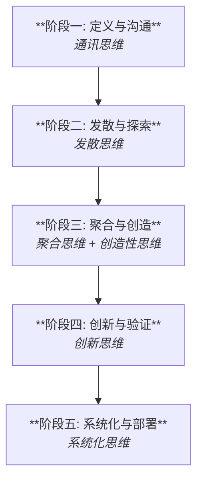

### **上下文工程思维模式应用蓝图：从构想到实现的五步法**

这是一个将多种思维模式整合到项目流程中的实践蓝图，旨在指导工程师系统性地、创造性地完成从定义问题到部署解决方案的全过程。

---

#### **阶段一：定义与沟通 (Define & Communicate)**
*   **阶段目标：** 精准理解并定义任务。确保人与AI对目标、约束和成功标准有一致的理解。
*   **主导思维模式：** **通讯思维**
*   **关键行动：**
    1.  **明确意图：** 我到底想让AI做什么？最终的产出给谁看？
    2.  **分析接收者(AI)：** 我使用的模型擅长什么，不擅长什么？我需要提供哪些背景知识才能让它理解任务？
    3.  **编码指令：** 编写一个清晰的“任务简报”式初始提示，包含背景、目标、角色、关键约束和输出格式要求。
*   **产出示例：** 一个明确的任务定义提示，如：“**背景：**我们是一家精品咖啡馆，将推出一款名为‘晨雾’的新咖啡豆。**目标：**撰写一篇社交媒体帖子，吸引年轻白领购买。**约束：**文案需在150字以内，包含#晨雾咖啡#标签。”

---

#### **阶段二：发散与探索 (Diverge & Explore)**
*   **阶段目标：** 产生大量、多样的初步想法和可能性。
*   **主导思维模式：** **发散思维**
*   **关键行动：**
    1.  **开放式提问：** 使用宽泛的指令，鼓励AI从不同角度进行头脑风暴。
    2.  **移除限制：** 暂时去掉阶段一的部分约束（如具体格式），让AI自由发挥。
    3.  **多维度探索：** 要求AI从不同文体（故事、诗歌、问答）、不同角度（咖啡师、顾客、咖啡豆本身）进行创作。
*   **产出示例：** 一个包含多种创意方向的列表，如：“**指令：**为‘晨雾’咖啡豆构思10个不同的社交媒体帖子创意点子。**输出：** 1. 咖啡豆的旅行日记；2. 采访首席咖啡师；3. ‘晨雾’能搭配的三种早餐；4. 一个关于早晨灵感的故事……”

---

#### **阶段三：聚合与创造 (Converge & Create)**
*   **阶段目标：** 从众多可能性中筛选出最佳方向，并为其注入独特的创意灵魂。
*   **主导思维模式：** **聚合思维 + 联想/创造性思维**
*   **关键行动：**
    1.  **建立标准（聚合）：** 根据阶段一的目标（吸引年轻白领），设定评估标准（如：新颖性、情感共鸣、行动引导性）。
    2.  **筛选方案（聚合）：** 选出1-2个最符合标准的创意方向（如“咖啡豆的旅行日记”）。
    3.  **注入创意（创造性）：** 使用类比、隐喻或独特的角色设定，对选定的方向进行重塑。
*   **产出示例：** 一个融合了创意元素的精炼提示，如：“**指令：**以‘一位经验丰富的植物探险家’的口吻，撰写‘晨雾’咖啡豆的旅行日记，描述它从埃塞俄比亚高地到我们烘焙坊的旅程。”

---

#### **阶段四：创新与验证 (Innovate & Validate)**
*   **阶段目标：** 确保创意方案不仅新颖，而且在现实世界中可行、有价值。
*   **主导思维模式：** **创新思维**
*   **关键行动：**
    1.  **融入现实约束：** 将阶段一中所有的约束条件（字数、标签、号召性用语CTA）重新加入提示中。
    2.  **价值评估：** 审视生成的文案，它是否真的能驱动用户产生购买欲望？是否符合品牌调性？
    3.  **迭代优化：** 根据评估结果，微调提示，比如增强行动指令的明确性。
*   **产出示例：** 一个接近最终稿的、兼具创意与实用性的文案，如：“……现在，这位‘探险家’正在我们的吧台等待着你。进店说出暗号‘探索晨雾’，即可享受首杯8折优惠。#晨雾咖啡#”

---

#### **阶段五：系统化与部署 (Systematize & Deploy)**
*   **阶段目标：** 将成功的交互模式转化为可复用、可自动化的流程或模板。
*   **主导思维模式：** **系统化思维**
*   **关键行动：**
    1.  **识别变量：** 分析最终成功的提示，找出哪些是可变部分（如：咖啡豆名称、产地、优惠活动）。
    2.  **构建模板/提示链：** 将提示转化为一个带有占位符的模板。如果任务复杂，则分解为多个步骤，形成提示链。
    3.  **定义接口：** 明确这个“系统”的输入（需要填写的变量）和输出（最终生成的文案），使其可以被其他程序或非技术人员轻松调用。
*   **产出示例：** 一个可复用的提示模板：“**角色：**一位经验丰富的植物探险家。**任务：**撰写`[咖啡豆名称]`的旅行日记，描述其从`[原产地]`到我们烘焙坊的旅程。文案需在150字以内，并包含`[优惠活动详情]`和`[指定标签]`。”

---
[[实战篇 - 自媒体制作]]