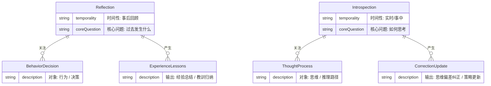
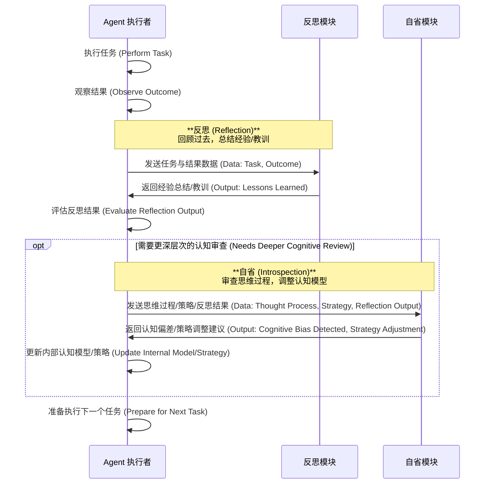
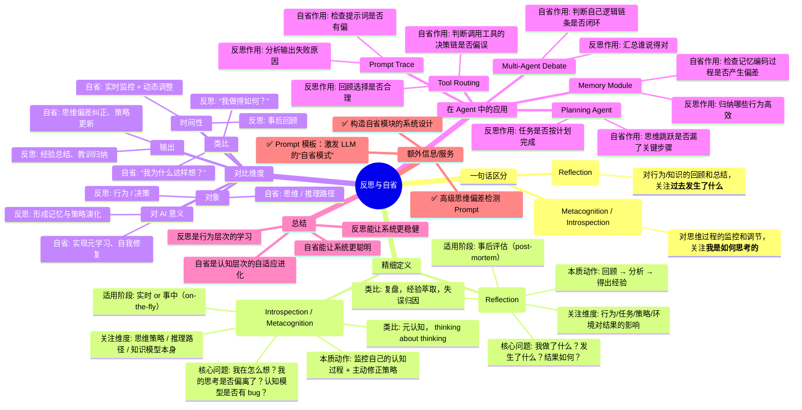

好问题，Sam。

这两个词在日常语境中经常互换使用，但如果你要构建一个具备“高级自我调优能力”的 Agent 或人类学习模型，区分它们是必要的。

---

## 🔍 一句话区分

| 概念                                    | 一句话理解                       |
| ------------------------------------- | --------------------------- |
| **反思（Reflection）**                    | 对行为/知识的回顾和总结，关注**过去发生了什么**。 |
| **自省（Metacognition / Introspection）** | 对思维过程的监控和调节，关注**我是如何思考的**。  |

---

## 🧠 精细定义

### 1. 🪞反思（Reflection）

- **核心问题**：我做了什么？发生了什么？结果如何？

- **本质动作**：回顾 → 分析 → 得出经验

- **关注维度**：行为/任务/策略/环境对结果的影响

- **适用阶段**：事后评估（post-mortem / retrospective）

- **举例**：

  - “我为什么在这次代码审查中被指出了变量命名问题？”

  - “我发现 Prompt 不够具体，导致模型输出不稳定。”

> 类似于复盘，强调“经验萃取”和“失误归因”。

---

### 2. 🧬自省（Introspection / Metacognition）

- **核心问题**：我在怎么想？我的思考是否偏离了？认知模型是否有 bug？

- **本质动作**：监控自己的认知过程 + 主动修正策略

- **关注维度**：思维策略 / 推理路径 / 知识模型本身

- **适用阶段**：实时 or 事中（on-the-fly metacognitive control）

- **举例**：

  - “我是不是陷入了确认偏误？我为什么会觉得这个答案‘看起来正确’？”

  - “我刚才的推理是不是跳过了一个隐含假设？”

> 更接近“元认知”（thinking about thinking），强调对认知过程本身的觉察与调控。

---

## 🔁 对比表格

| 维度      | 反思 Reflection | 自省 Introspection |
| ------- | ------------- | ---------------- |
| 对象      | 行为 / 决策       | 思维 / 推理路径        |
| 时间性     | 事后回顾          | 实时监控 + 动态调整      |
| 输出      | 经验总结、教训归纳     | 思维偏差纠正、策略更新      |
| 对 AI 意义 | 形成记忆与策略演化     | 实现元学习、自我修复       |
| 类比      | “我做得如何？”      | “我为什么这样想？”       |

---

## 🚀 在 Agent 中的应用

| Agent 模块           | 反思作用      | 自省作用           |
| ------------------ | --------- | -------------- |
| Prompt Trace       | 分析输出失败原因  | 检查提示词是否有偏      |
| Tool Routing       | 回顾选择是否合理  | 判断调用工具的决策链是否偏误 |
| Planning Agent     | 任务是否按计划完成 | 思维跳跃是否漏了关键步骤   |
| Memory Module      | 归纳哪些行为高效  | 检查记忆编码过程是否产生偏差 |
| Multi-Agent Debate | 汇总谁说得对    | 判断自己逻辑链条是否闭环   |

---

## 🧩 总结

> **反思是行为层次的学习，自省是认知层次的自适应进化。**

- **反思能让系统更稳健**

- **自省能让系统更聪明**

---

如果你正在构建 Agent 或写 Prompt，我可以提供：

- ✅ Prompt 模板：如何激发 LLM 的“自省模式”

- ✅ 构造自省模块的系统设计（带元推理链结构）

- ✅ 高级思维偏差检测 Prompt（用于 Agent 自调优）

需要哪部分？我可以按模块生成。

---

## Mermaid流程图

[🧜‍♀️ Mermaid 功能探究 · Refly](https://refly.ai/share/canvas/can-ut29sdt61c0ujktd2uhm2o3b)

好的，参考您提供的 Mermaid ER 图语法示例，我将重新生成符合 [[反思与自省-Mermaid大放送]] 笔记内容的实体关系图。

### 时序图

好的，根据您 [[反思与自省-Mermaid大放送]] 这篇笔记的内容，我可以为您绘制一个时序图，来展示在一个 Agent 的工作流中，反思和自省可能发生的一个逻辑序列。

这并不是笔记中明确给出的步骤，而是基于笔记对这两个概念的定义和在 Agent 中的应用，构建的一个可能的流程示例。

以下是使用 Mermaid 语法绘制的时序图：

**说明:**

1. Agent 执行任务并观察结果。
2. Agent 将任务和结果发送给 **反思模块**。
3. 反思模块处理数据，总结经验教训，并返回给 Agent。这一步关注的是“**过去发生了什么**”。
4. Agent 评估反思结果。
5. **可选步骤**: 如果 Agent 判断需要对自身的思维过程进行审查（可能由反思结果触发，例如发现重复的错误模式），它将启动 **自省模块**。
6. Agent 将相关的思维过程、策略等信息发送给自省模块。
7. 自省模块审查 Agent 的认知过程，检测可能的偏差，并提出策略调整建议，返回给 Agent。这一步关注的是“**我是如何思考的**”。
8. Agent 根据自省结果更新其内部的认知模型或策略。
9. Agent 准备进行下一个任务。

这个时序图试图捕捉笔记中描述的，反思关注事后行为，而自省关注实时/事中的认知过程，并在 Agent 工作流中展示它们可能如何协作或独立发生。

### 思维导图
好的，根据您 [[反思与自省-Mermaid大放送]] 这篇笔记的内容，我可以为您绘制一个思维导图。

以下是使用 Mermaid 语法绘制的思维导图：

这个思维导图结构化地展示了笔记中的主要概念、定义、对比、应用和总结。