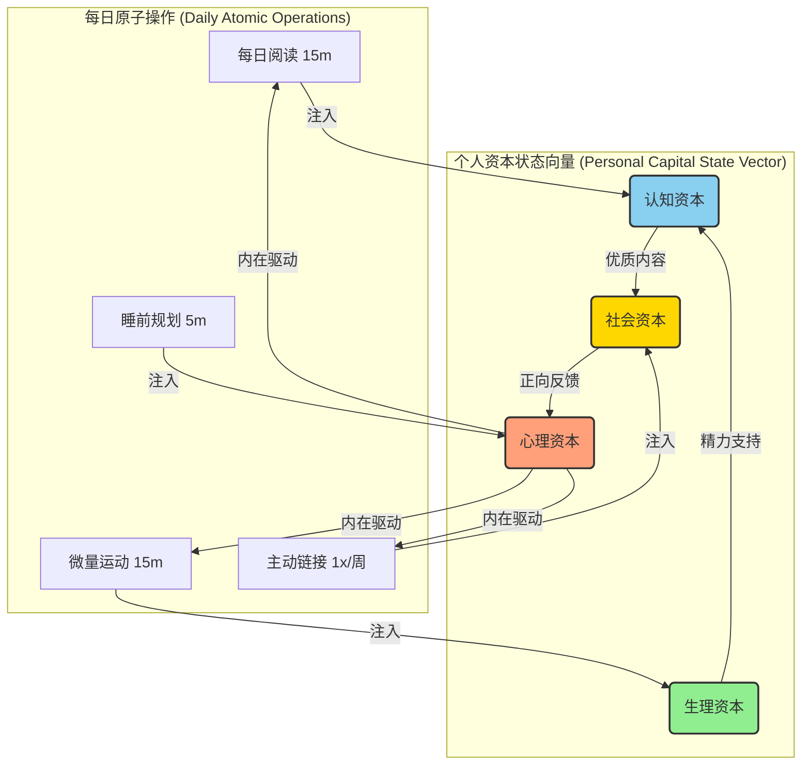
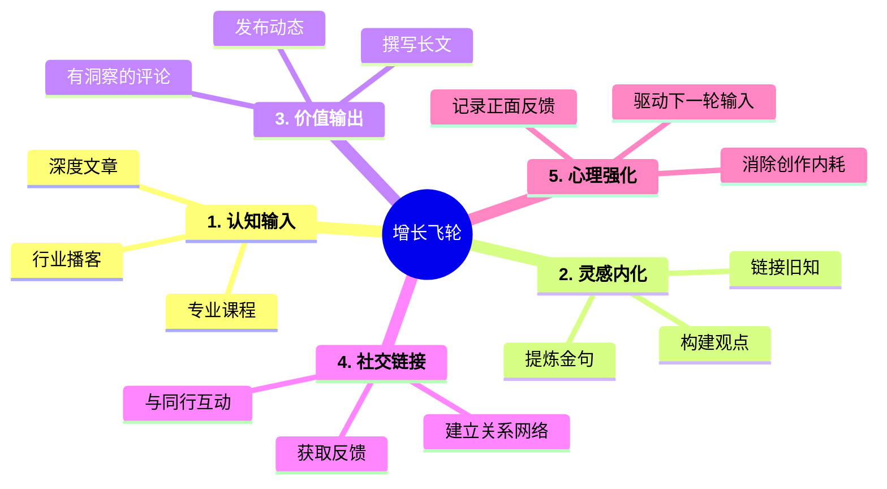

# H1: 微习惯播种：构建你的个人成长操作系统

> "我们由反复从事的行为塑造。因此，卓越不是一次行为，而是一种习惯。" —— 威尔·杜兰特

## H2: 核心系统模型：资本的耦合与增益

个人成长不是孤立模块的线性叠加，而是一个各资本相互耦合、彼此增强的复杂系统。每日的微小行动如同注入系统的能量，驱动整个状态向量向前演进。

## H2: 系统组件的数学抽象

*   **状态向量 (State Vector):** 你的当前状态。
    $S(t) = [认知, 生理, 社会, 心理, ...]$
*   **原子操作 (Atomic Operation):** 每一个不可再分的微习惯。
    `read_article()`, `do_pushups()`, `plan_tomorrow()`
*   **状态转移函数 (State Transition):** 系统演进的规则。
    $S_{t+1} = f(S_t, \text{Action}_t) - \text{Decay}_t$
*   **长期目标函数 (Objective Function):** 你最终想优化的目标。
    $Maximize(\text{影响力})$，其中影响力是各资本的加权函数。

## H2: 内容创作者的增长飞轮

对于内容创作者，微习惯的组合可以构建一个强大的正反馈循环，我们称之为“增长飞轮”。

## H2: 行动纲领：最低可执行协议 (MEP)

将习惯转化为协议，像计算机执行代码一样，无情地、持续地执行。

*   **认知协议:** `IF day_starts THEN read(1) ELSE pass`
    *   **目标:** 保证知识流的持续注入，对抗信息熵增。
*   **输出协议:** `IF learned(something) THEN share(1) ELSE pass`
    *   **目标:** 将个人知识转化为公共价值，启动影响力复利。
*   **链接协议:** `IF week_starts THEN connect(1) ELSE pass`
    *   **目标:** 将个人节点接入更广阔的网络，提升节点中心度。
*   **规划协议:** `IF day_ends THEN plan(next_day_task) ELSE pass`
    *   **目标:** 降低次日启动的“冷启动”成本，预加载任务上下文。

> "复利是世界第八大奇迹。理解它的人，赚取它；不理解的人，支付它。"