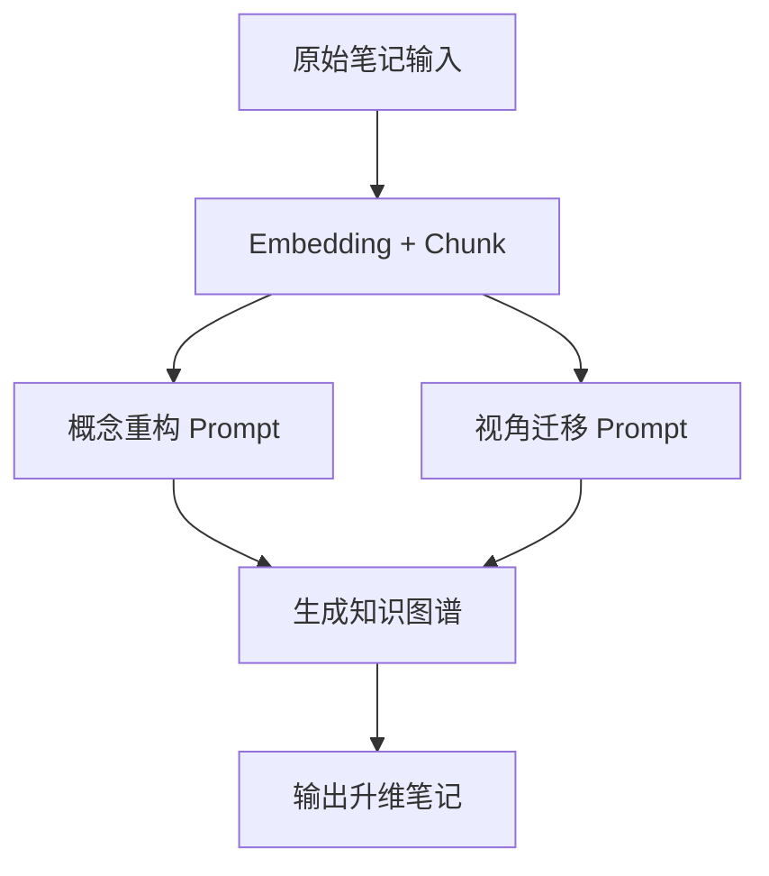

实现“笔记的认知升维”，目标是：

> **基于已有笔记，生成出更抽象、更通用、更系统、更创新的结构和表达，形成新的知识构造。**

这相当于从“信息”到“知识”再到“洞见（insight）”的跃迁。  
下面直接给你几个可以在 Obsidian / Notion / LangGraph Agent / ChatGPT 中使用的 Prompt，支持你将笔记从“事实堆积”变为“结构化的洞察体系”。

---

## 🔮 认知升维提示词（Prompt）合集

### 🧱 1. 概念重构 Prompt（知识结构层级跃迁）

```text
请从以下笔记内容中抽象出三层结构：
- Layer 1：核心概念（不超过 5 个）
- Layer 2：每个概念下的关键要素（关键词+定义）
- Layer 3：要素之间的逻辑关系（因果、并列、循环等）

笔记内容：
""" 
{{你的笔记内容}} 
"""
```

---

### 🧭 2. 生成多视角解释（高阶认知迁移）

```text
基于以下笔记内容，分别用以下视角进行重述和扩展：
- 系统设计者视角
- 商业变现视角
- AI 模型建构者视角
- 学术研究者视角
- 认知科学视角

请指出：每种视角下，原始内容的意义、局限性、延伸空间。
内容如下：
"""
{{你的笔记内容}}
"""
```

---

### 🧠 3. 自我[[知识图谱]]生成 Prompt（构建 higher-order map）

```text
请基于以下笔记内容，构建一张自我知识图谱，包含：
- 节点（概念 / 方法 / 工具 / 框架）
- 节点之间的关联（使用关系 / 影响关系 / 对立关系 / 演化关系）
- 图谱中心节点是哪些？外围扩展方向是哪些？
- 衍生出哪些研究/实践问题？

笔记内容如下：
"""
{{你的笔记内容}}
"""
```

---

### 🧬 4. 升维类比（从低维知识构造 → 高维思维迁移）

```text
请基于以下笔记内容，尝试以不同学科的“类比映射”方式进行升维，目标是提炼出创新性的洞见。
- 用物理学类比该笔记：哪些变量或结构是“能量”？“力场”？
- 用生物学类比该笔记：是否存在“进化”或“共生”结构？
- 用计算机结构类比：是否可以抽象为“算法”、“数据结构”或“分布式系统”？

笔记内容如下：
"""
{{你的笔记内容}}
"""
```

---

### 🔁 5. 知识循环生成器（认知反馈环）

```text
请从以下笔记出发，构建一个“认知反馈环”，包含以下四个环节：
1. 现有知识（你已知的内容）
2. 关键疑问（尚未解决的核心问题）
3. 实验假设或验证策略（你可以怎么动手推演或验证）
4. 学习迁移目标（未来你可以把这套知识用在哪里）

原始笔记如下：
"""
{{你的笔记内容}}
"""
```

---

## 🧩 使用建议（可搭配 LangGraph Flow）

你可以构建一个 **认知升维 Flow**，组件化调用以上 Prompt 作为工具：



---

## 🚀 想更进一步？

我们可以基于 Obsidian + LangGraph/Gemini，搭建一个“认知升维 Agent”，自动帮你：

- 每晚复盘当天新笔记
    
- 自动升维分析、打标签、生成结构图谱
    
- 总结每天的“知识跃迁点”
    

如果你想做这个系统化工具，我可以和你一起搭建原型流程。要开始吗？