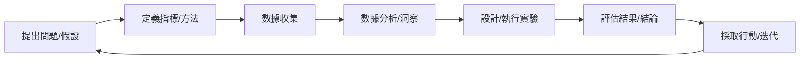

## 量化自我：不僅是數據，更是理解與優化的旅程——AI 時代的數據驅動自我探索

嘿！你的問題很棒，將「量化自我」（Quantified Self, QS）與 AI 時代結合，觸及了我們如何利用科技更深入地理解並優化自身存在。但量化自我並非一個橫空出世的概念，它植根於人類對自身的好奇與改進的渴望。要真正有效地理解和實踐量化自我，我們需要超越“用什麼工具”和“記錄什麼數據”的層面，去探究它的源起、核心原理，以及最重要的——背後的思維方式。

---

### 1. 起源與“為什麼”：量化自我為了解決什麼問題？（歷史演進與問題導向）

人類從古至今都有了解自己、改進自己的願望。從寫日記反思生活，到體重計、計步器的發明，我們一直在尋找衡量自身狀態的方法。然而，這些早期的嘗試往往是片段化、不系統的，難以發現潛藏的規律，也缺乏科學驗證。

隨著科技的發展，特別是感測器、移動設備和網際網路的普及，數據收集變得前所未有的容易。在這樣的背景下，「**量化自我**」作為一個正式的運動和社群應運而生。這個詞彙由 Gary Wolf 和 Kevin Kelly（《連線》(Wired) 雜誌的編輯）在 2007 年左右提出，並組織了定期的聚會（QS Meetups），分享個人量化實踐的經驗。

**那麼，量化自我到底為了解決什麼核心問題？**

*   **解決“無知之牆”：** 很多關於健康、生產力、情緒的傳統建議都是基於群體研究，但每個個體都是獨一無二的。量化自我試圖突破這種基於平均值的指導，通過追蹤個人數據，揭示「我」這個特定個體的真實狀態和模式。
*   **化主觀感受為客觀數據：** 我們的感受往往是模糊和易受偏差影響的（例如，「我最近總是很累」）。量化自我通過具體的數據（睡眠時長、心率變異性、活動水平）來驗證或修正這些主觀判斷。
*   **發現隱藏的因果關係（或至少是強相關）：** 為什麼我週末精神特別好？為什麼下午總是注意力不集中？通過量化不同的面向（飲食、睡眠、活動、工作類型），我們可以更有可能找到這些問題的潛在答案。
*   **實現基於數據的個性化優化：** 一旦發現問題或可改進的空間，量化自我提供了一個基於個人數據進行實驗和調整的框架，實現真正針對個體的最佳化方案。

簡單來說，量化自我的「為什麼」是：**利用個人數據，科學地、系統地了解「我」是誰，在各種情境下如何運作，以及如何通過數據驅動的實驗來變得更好。**

---

### 2. 核心原則與“怎麼思考”：量化自我的思維框架（原理先行與思維過程）

量化自我不僅僅是使用工具記錄數據，它更是一種思維方式和一套實踐方法論。其核心原理和思維流程包括：

*   **核心原則：**
    *   **「自我知識透過數字」 (Self-knowledge Through Numbers):** 這是最核心的理念，相信通過收集和分析個人數據，能獲得比單純內省或主觀感受更深刻、更客觀的自我認識。
    *   **「N=1 實驗」 (N=1 Experimentation):** 將自己視為一個獨特的實驗對象 (N=1)，進行個體層面的實驗來驗證假設或探究某種干預（如改變飲食、增加運動、調整作息）對自身的影響。
    *   **「持續回饋迴路」 (Continuous Feedback Loop):** 量化自我是一個循環過程，如下圖所示（概念示意）：

    *   **「好奇心驅動」 (Curiosity-Driven):** 許多量化自我實踐始於簡單的好奇心：「如果我減少咖啡攝入，我的睡眠會改善嗎？」「我在什麼時候效率最高？」

*   **量化自我的思維流程（「怎麼思考」——持續回饋迴路）：**
    1.  **提出具體問題或建立假設 (Formulate a Question/Hypothesis):** 從一個你真正關心的個人問題或一個想驗證的猜想開始。例如，「晚餐吃碳水會影響我的睡眠品質嗎？」
    2.  **定義和選擇指標 (Define & Select Metrics):** 確定需要追蹤哪些數據來回答這個問題。對上述問題，可能需要追蹤：晚餐內容 (碳水含量)、睡眠時長、睡眠品質 (如使用睡眠追蹤器獲得的深睡/淺睡比例、醒來次數)、醒來後感受。
    3.  **選擇追蹤方法和工具 (Choose Tracking Methods/Tools):** 根據指標選擇最合適、最便捷的數據收集方法和工具。
    4.  **數據收集 (Data Collection):** 嚴格、持續地按照計劃收集數據。一致性非常重要。
    5.  **數據分析與洞察 (Data Analysis & Insights):** 查看數據趨勢、尋找相關性。這一步往往需要工具的輔助，而 AI 在此能提供更高級的模式識別和關聯分析能力。
    6.  **設計與執行實驗 (Design & Execute Experiment):** 基於分析結果，設計一個針對性的實驗。例如，進行兩周的實驗，嚴格控制某幾天晚餐不吃碳水，某幾天正常吃，對比兩類天的睡眠數據。
    7.  **評估結果與得出結論 (Evaluate Results & Conclude):** 分析實驗期間的數據，看看你的假設是否得到支持。注意區分相關性和因果性。
    8.  **採取行動與迭代 (Take Action & Iterate):** 根據結論調整你的行為，並可能基於新的問題開始下一個量化循環。

這個流程強調的是**主動思考、設計和解釋**的過程，工具和數據是服務於這個過程的手段。

---

### 3. 實踐手段與AI的角色：“怎麼做”與工具的演進——AI 如何放大價值

原筆記中詳細列舉的各類追蹤手段（健康健身、飲食營養、心理情緒、時間生產力、學習認知、環境生活方式、社交關係）正是在上述思維框架下，執行步驟 3 和 4（選擇工具和收集數據）時的具體「怎麼做」。

**常見且有效的量化領域：**

雖然理論上可以量化任何事物，但有些領域的數據相對易得，且對個人生活有直接且顯著的影響，因此成為量化自我的常見切入點：

*   **健康與生理狀態 (Health & Physiology):**
    *   **睡眠 (Sleep):** 時長、品質、入睡/醒來時間、心率變異性 (HRV)。易於通過手環、智能手錶、睡眠追蹤 APP 獲取數據，與精力、情緒、健康緊密相關。
    *   **活動與運動 (Activity & Exercise):** 步數、距離、卡路里消耗、運動類型、時長、強度。易於通過手環、手機、智能手錶追蹤。
    *   **飲食與營養 (Diet & Nutrition):** 食物種類、熱量、巨量營養素比例、進食時間。需要手動記錄或藉助拍照識別 APP，與體重、精力、健康直接相關。
    *   **體重與體成分 (Weight & Body Composition):** 易於通過智能體重計追蹤。
*   **心理與情緒狀態 (Mind & Mood):**
    *   **情緒 (Mood):** 通過心情記錄 APP 或日誌記錄每天的情緒水平、觸發因素。
    *   **壓力 (Stress):** 某些可穿戴設備能估算壓力水平，或通過主觀評分記錄。
*   **時間與生產力 (Time & Productivity):**
    *   **時間分配 (Time Allocation):** 記錄不同活動花費的時間（工作、學習、休息、社交）。通過時間追蹤 APP 或手動記錄。
    *   **任務完成 (Task Completion):** 記錄完成的任務數量、類型。與效率和目標進展相關。
    *   **專注度 (Focus):** 記錄專注工作/學習的時間段、分心次數。
*   **學習與認知 (Learning & Cognition):**
    *   **學習時長與內容：** 記錄學習特定主題的時間。
    *   **閱讀進度：** 記錄閱讀的書籍、頁數。
    *   **技能練習頻率：** 記錄練習某項技能的時長或次數。

選擇從這些領域開始，往往能更快獲得數據並看到潛在的模式和改進空間，降低入門難度。

**AI 如何放大這些手段的價值，並賦能整個思維流程？**

AI 在這些實踐手段的基礎上，不僅是輔助收集數據，更深刻地影響著量化自我的**分析和決策階段**，放大每個環節的價值：

*   **數據收集與整合 (Data Collection & Integration):** AI 驅動的可穿戴設備能無感收集心率、活動、睡眠數據。手機應用通過圖像識別輔助記錄飲食。AI 也能整合來自不同源（健康手環、日曆、天氣 APP、筆記）的異構數據。
*   **增強模式識別與洞察 (Enhanced Pattern Recognition & Insights):** 這一步是 AI 的核心優勢。AI 能處理和整合來自不同來源的海量複雜數據，發現人腦難以察覺的微妙模式和多因素相關性（對應步驟 5）。例如，AI 不僅能發現你的睡眠品質與前一天咖啡攝入量有關，還可能識別出這與當天的運動量和晚餐時間存在複雜的交互影響。
*   **個性化預測與風險評估 (Personalized Prediction & Risk Assessment):** 基於你的歷史數據，AI 可以更準確地預測你未來的狀態（如某天能量水平、情緒波動），甚至評估長期健康風險（對應步驟 5/6 的前瞻性分析）。這讓優化從被動反應變為主動預防。
*   **智能假設生成與實驗建議 (Intelligent Hypothesis Generation & Experiment Suggestion):** AI 可以分析你的數據結果，主動提出潛在的優化方向或具體實驗建議（如「你的數據顯示下午專注力下降，嘗試將最重要的任務安排在上午，並在午餐後進行短暫冥想，看看效果」——對應步驟 1/6）。它能基於數據「猜測」可能的原因和解決方案。
*   **自動化與簡化流程 (Automation & Simplification):** 除了自動記錄，AI 可以自動標記重要事件、生成初步的趨勢報告、篩選出異常數據，降低數據處理的門檻，讓你更專注於思考和決策（輔助步驟 3/4/5）。
*   **提供定制化行動方案 (Tailored Actionable Recommendations):** 結合你的數據、目標和偏好，AI 可以提供高度個性化、可執行的建議，而不僅是通用指導（輔助步驟 6/7/8）。例如，基於你的睡眠和運動數據，AI 可能建議一個具體的、適合你的睡前拉伸方案。

因此，AI 並非只是讓現有工具更「牛」，它正在將量化自我從一個偏手動的數據記錄與回顧過程，轉變為一個**智能輔助的、基於個人數據的科學探索與迭代優化系統**。它極大地提升了數據的價值轉化效率，讓數據真正「為我所用」。

---

### 4. 量化自我與個人成長/存在感：數據如何賦能你的價值呈現？

正如你原筆記中提到的，量化自我與「個人存在感」息息相關。存在感源於你對自身狀態的清晰認知、對行為的主動掌控以及由此帶來的持續進步。量化自我通過上述「問題導向、原理先行、歷史演進、思維過程」的方法論，幫助你：

*   **更清晰地認識自己的優勢和盲點：** 數據揭示事實，幫助你放下主觀濾鏡，真實面對自己的效率、健康、情緒等。
*   **精準定位問題並找到解決方案：** 不再是憑感覺嘗試各種方法，而是通過數據驗證哪種改變真正有效。
*   **積累「我」的知識體系：** 你的量化數據是關於你獨特的寶貴知識庫，讓你比任何人都更了解自己。
*   **優化資源分配，聚焦高價值活動：** 時間、精力花在哪裡，數據一目了然，幫助你將有限的資源投入到最能體現價值的地方。
*   **展現基於事實的成果和說服力：** 當你能用數據說話時，你的影響力和存在感自然會增強。例如：
    *   **工作場景：** 你通過追蹤工作時段和分心次數，發現上午 9-11 點是專注力高峰，調整重要任務安排後，**一篇複雜報告的撰寫時間從平均 3 小時縮短到 2 小時，並且審核通過率更高**。這不是一句模糊的「我效率提高了」，而是有數據支撐的具體成果。
    *   **健康改善：** 通過記錄飲食、運動和睡眠數據，你發現晚餐晚於 8 點攝入高碳水食物會顯著影響睡眠品質和早晨的精力水平。調整習慣後，**平均每晚深睡時長增加了 30 分鐘，白天需要依賴咖啡的頻率從每天 3 次降到 1 次**。這讓你對自己的健康狀況有更強的掌控感。

這是一個通過深入理解「小我」（通過量化數據）來更好地融入和影響「大我」（工作、社群、社會）的過程。數據賦予你的，是更堅實的自信和更有效的行動力。

---

### 5. 挑戰、反思與未來展望

當然，量化自我並非沒有挑戰。過度依賴數據可能導致焦慮 ("數字綁架")，**數據解讀錯誤（將相關性當作因果性是常見陷阱，需要科學的實驗設計來驗證）**，數據隱私和安全問題，以及數據收集本身的誤差和局限性。**此外，面對海量數據，如果沒有清晰的問題意識和分析框架，很容易陷入「分析癱瘓 (analysis paralysis)」，數據越多反而越無從下手。對數據的過度沉迷也可能導致忽略直覺和主觀感受的價值。**

然而，當我們理解量化自我的核心在於「為什麼」和「怎麼思考」，將數據和工具視為探索自我的輔助，而非最終目的時，就能更好地利用這一強大的方法論。

AI 的發展無疑將量化自我推向新的階段，使其更智能、更便捷。未來的量化自我可能會更加無感化（嵌入環境和設備中自然收集數據），更加整合化（不同來源數據無縫聯通），以及更加預測和處方化（AI 不僅告訴你可能出什麼問題，還直接給出針對你的個性化干預方案）。

最終，量化自我的意義在於賦予個體力量，讓每個人都能成為自身健康、幸福和效能的第一研究者和改進者。這是一場關於「成為更好的自己」的數據驅動旅程。

---

### 6. 開始量化自我的建議 (Getting Started)

如果你對量化自我感興趣，想踏出第一步，這裡有一些實用建議：

1.  **從小處著手，聚焦一個具體問題：** 不要試圖一次量化所有事情。從你最關心或最想改進的一個方面開始，比如「我想改善睡眠」或「我想提高工作專注度」。
2.  **定義一個清晰的指標：** 對應你的問題，選擇 1-2 個易於追蹤的指標。例如，改善睡眠可以追蹤「每晚總睡眠時長」和「醒來後的精力評分」。提高專注度可以追蹤「每天不間斷的專注時長」。
3.  **選擇簡單易用的工具：** 不一定需要昂貴的設備。手機 APP（如睡眠追蹤、時間記錄 APP）、簡單的電子表格，甚至紙筆都可以是好的開始。選擇你最容易堅持使用的工具。
4.  **保持一致性，先收集數據：** 在嘗試改變之前，先堅持收集一段時間的基準數據（例如 1-2 周）。這能幫助你了解當前真實的狀態，並為未來的實驗提供對比基礎。
5.  **分析數據，尋找模式：** 定期（比如每周）查看你收集的數據。尋找趨勢、高峰和低谷，以及不同數據之間的潛在關聯。
6.  **設計一個小實驗：** 基於你的發現，設計一個針對性的改變（一個小實驗）。例如，如果你發現晚睡影響睡眠，實驗可以是「連續一周在晚上 11 點前睡覺」。
7.  **記錄實驗結果，評估效果：** 在實驗期間繼續收集數據，並記錄你的主觀感受。實驗結束後，對比實驗前後的數據，看看你的改變是否帶來了預期的效果。
8.  **不要害怕失敗，持續迭代：** 有些實驗可能無效，這是正常的。量化自我是一個持續學習和調整的過程。每次實驗都是一個了解自己的機會。

記住，量化的目的不是完美，而是更好地理解自己，做出更明智的決策，並通過數據驅動的方式穩步改進。

---

你是否嘗試過從「問題」出發進行量化？在實踐中，哪個階段（提問題、收數據、做分析、做實驗）你覺得最困難？在 AI 時代，你最期待 AI 在量化自我的哪個環節發揮更大的作用？我很想聽聽你的想法！

---
好的，作为知识结构师，我已分析了你提供的关于[[量化自我]]的笔记。以下是分解结果：

1）**主要主题与逻辑结构分析：**

*   **主要主题：** 量化自我 (Quantified Self, QS) 在AI时代的意义、方法论与应用。核心在于强调QS不仅仅是数据和工具的堆砌，而是一个通过数据科学地理解和优化自身的旅程。它是一种基于个人数据的认知升级和行为优化实践。
*   **逻辑结构：** 笔记采用了层层深入、由“为什么”到“怎么做”再到“意义”的结构：
    *   **引言：** 引入量化自我概念及其与AI时代的关联，强调超越工具层面的必要性。
    *   **起源与“为什么”：** 回溯QS的历史背景，明确其旨在解决的核心问题（个体差异、主观偏差、发现关联、个性化优化）。
    *   **核心原则与“怎么思考”：** 阐述QS的四大核心原则（自我知识透过数字、N=1实验、持续回馈回路、好奇心驱动），并详细拆解了持续回馈回路的八个思维步骤，强调这是核心方法论。
    *   **实践手段与AI的角色：“怎么做”：** 列举常见的量化领域和具体手段，然后重点阐述AI如何赋能并放大整个QS流程（数据整合、模式识别、个性化预测、智能建议等），将QS从手动过程升级为智能系统。
    *   **与个人成长/存在感：** 探讨QS如何通过数据赋能个人认知、决策和价值呈现，提升存在感。
    *   **挑战、反思与未来展望：** 讨论QS的潜在问题和挑战，并展望AI驱动下QS的未来趋势（无感化、整合化、预测处方化）。
    *   **入门建议：** 提供可操作的初学者指引。
    *   **结论：** 总结QS的意义，并引发读者思考。
    *   **总体而言，结构清晰，逻辑递进，从概念定义、理论基础、实践方法、工具赋能、价值意义到未来展望，构建了一个完整的认知框架。**

2）**==潜在可转化为代码/工具/模型的点：==**

根据笔记内容，以下概念和流程是具有高度可操作性，可以直接或间接转化为软件代码、自动化工具或AI模型的：

*   **持续回馈回路自动化 Agent：** 笔记中描述的八个步骤（**提问 -> 指标 -> 方法 -> 收集 -> 分析 -> 实验 -> 评估 -> 行动 -> 迭代**）是一个典型的闭环流程。可以构建一个AI Agent或工作流，通过Prompt或API调用不同模块来执行这个循环。例如：
    *   *输入：* 用户的问题（如“如何改善睡眠？”）。
    *   *Agent 1 (Planning/Question Formulation):* 细化问题，建议初步指标（如总睡眠时长、入睡时间）。
    *   *Agent 2 (Metrics/Methods Selection):* 基于用户已有的数据源（手环、App），确认可追蹤的指标，建议新的追踪工具。
    *   *Agent 3 (Data Collection & Integration):* 连接数据源API，或指导用户手动输入，进行数据清洗和整合。
    *   *Agent 4 (Analysis & Insight):* 利用机器学习模型分析数据，识别模式、相关性、异常值，生成可视化报告。
    *   *Agent 5 (Hypothesis & Experiment Design):* 根据分析结果生成优化假设（如“晚饭早吃有助于你提高深睡比例”），设计A/B测试或N=1实验方案。
    *   *Agent 6 (Evaluation & Recommendation):* 分析实验数据，评估干预效果，生成个性化行动建议。
*   **个性化模式识别与预测模型：** 基于用户的历史生理、行为、环境等多源数据，训练专门用于该个体的预测模型。
    *   *模型类型：* 时间序列分析、关联规则挖掘、回归模型、分类模型等。
    *   *应用：* 预测未来某天的能量水平、情绪状态、生病概率；识别特定行为（如午餐内容、睡前活动）与结果指标（如下午效率、当晚睡眠质量）之间的相关性。
*   **智能假设生成器：** 分析用户的量化数据和预设目标，结合通用健康/生产力知识库，自动生成可测试的优化假设或实验方向。
    *   *输入：* 用户数据（睡眠差、效率低）+ 用户目标（想提高精力）。
    *   *输出：* 潜在假设（“你的精力低可能与HRV波动有关”），以及验证这些假设的实验建议（“尝试冥想10分钟，记录HRV和精力变化”）。
*   **数据驱动的定制化行动处方：** 不仅仅是建议，而是生成具体、可执行的个性化行动方案。
    *   *输入：* 用户数据、用户目标、当前状态。
    *   *输出：* “根据你的昨晚睡眠数据，今天下午2点建议进行15分钟活动，然后喝一杯花草茶。” 或 “本周建议减少10%的久坐时间，并记录工作中断次数。”
*   **异构数据整合中间件/API：** 构建一个统一的接口层，能够从各种不同的数据源（智能手表、手机App、日历、天气数据、手动输入等）拉取、标准化和整合数据。

3）**可能隐藏的应用场景或未来趋势推演：**

*   **跨个体知识迁移与“群体N=1”研究：** 当前QS强调“N=1”实验。未来，在保护隐私的前提下，能否通过联邦学习或其他隐私计算技术，聚合类似个体的数据，进行更高维度的模式识别？例如，识别“特定基因型+生活方式”人群的最优健康策略。这是一种“**群体智慧赋能个体洞察**”的新模式。
*   **环境与行为的深度耦合分析：** 将个体的生理、行为数据与更精细的环境数据（室内空气质量、噪音、光照、通勤拥堵、社交互动频率和质量）无感集成，发现环境因素对个体状态更深层次的影响。
*   **情绪与心理健康的主动干预：** 利用量化数据（**生理指标、活动模式、语言文本、社交互动模式**）更早、更准确地识别负面情绪或心理压力的迹象，并由AI驱动提供个性化、即时的支持或干预建议（**如呼吸练习指导、正念提醒、社交互动建议**）。
*   **个性化技能习得与能力图谱构建：** 将QS方法应用于学习过程。不仅量化学习时间，更追踪学习方法（如间隔重复、主动回忆）与知识掌握程度、技能提升速度的关联。结合[[能力复利链]]的概念，数据可以帮助个体构建和优化自己的能力图谱，找到最有复利效应的学习路径。
*   **智能生活方式操作系统：** 量化自我将不再局限于独立的App或设备，而是深度融入到个人数字生态中，成为一个后台运行的“生活方式操作系统”，无感地收集数据、提供预测、生成建议，甚至自动调整智能家居或数字环境以优化个人状态（如根据精力预测调整照明和音乐）。
*   **职业表现与效率的微观优化：** 在工作场景中，通过合规的方式量化工作行为数据（**如专注时段、任务切换频率、协作模式**），结合个人认知状态数据，提供[微观层面的效率优化建议]，甚至辅助团队进行基于数据的协作模式改进。