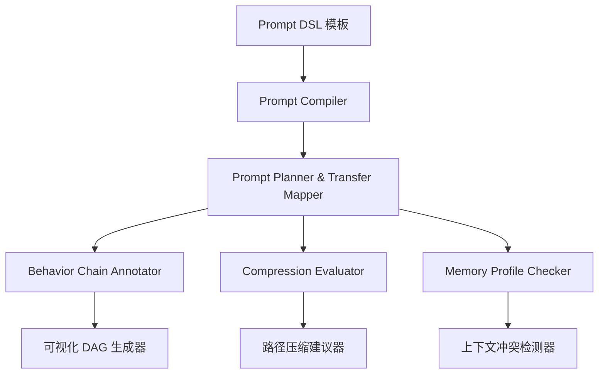

以下是围绕你提出的四个高阶模块概念的设计文档，构建目标为：**服务 Tool-Augmented Prompt System 的跨任务泛化、路径压缩与行为链调试能力提升。**

---

## 高阶模块设计文档合集

---

### 1. Cross-Task Prompt Transfer Mapping

**任务目标**：构建跨任务间可迁移的 Prompt 映射机制，实现 prompt module 的重用、泛化和迁移性分析。

#### 核心组件：

- **任务语义嵌套建模器**：将任务表示为分层结构（goal → intent → sub-intent → slot）。
    
- **模块语义嵌射模型**：将 Prompt 模块转化为向量或图结构（BERT+Graph Attention）。
    
- **迁移路径预测器**：输入 source_task_prompt → 输出 target_task_prompt 映射建议。
    

#### 示例输入：

```json
{
  "source_task": "summarize academic paper",
  "target_task": "generate meeting notes",
  "source_prompt_id": "extract_key_points"
}
```

#### 示例输出：

```json
{
  "mapped_prompt_id": "summarize_discussion",
  "mapping_type": "intent_reuse + slot_rename",
  "required_adaptations": ["slot: section_title → topic", "tone: formal → informal"]
}
```

#### 支持功能：

- Prompt 映射建议
    
- 可迁移性评分（Transferability Score）
    
- Slot mapping 自动重写
    

---

### 2. Prompt Compression Metrics Design

**任务目标**：评估 Prompt 树中各模块的压缩潜力与压缩效果，支持路径压缩策略的迭代。

#### 指标体系：

|指标名|定义说明|类型|
|---|---|---|
|Prompt Token Entropy|模板中信息熵分布（高→复杂）|复杂度|
|Behavior Coverage Ratio|模板覆盖的行为链分支数 / 总行为链|功能性|
|Slot Redundancy Index|多模板间 slot 重复使用比率|冗余度|
|Prompt Criticality Score|模板对最终 output 影响的平均变化率（ablation）|重要性|
|Compression Gain|压缩后 DAG 节点数减少量 / 原始节点数|减枝率|

#### 压缩策略接口：

- 合并等价模板（Equivalence Merge）
    
- Slot 抽象化（Slotization）
    
- 条件逻辑折叠（if/else → selector prompt）
    

---

### 3. Memory-Aware Prompt Comparison

**任务目标**：比较 Prompt 模板在 memory context 下的执行差异，识别上下文依赖与内存冲突风险。

#### 模块设计：

- **Memory Profile Generator**：分析 Prompt 执行对上下文窗口（K/V 缓存）的使用情况。
    
- **Interference Detector**：对比两个 prompt 使用 overlapping context 时是否互相干扰。
    
- **Semantic Drift Analyzer**：计算上下文注入前后输出偏移度。
    

#### 关键指标：

|指标|定义|
|---|---|
|Context Utilization (%)|Prompt + Memory 所占上下文比例|
|Memory Interference Rate|多 prompt 重用 context 时产生误差的频率|
|Drift Magnitude Score|上下文修改后输出结果的向量距离|

#### 示例结果：

```json
{
  "prompt_A": "retrieve_task_goal",
  "prompt_B": "refine_goal_steps",
  "interference": true,
  "conflict_slots": ["user_goal"],
  "suggestion": "isolate memory window for prompt_B"
}
```

---

### 4. Nested Behavior Chain Annotation

**任务目标**：对 prompt 模块执行中触发的行为链进行嵌套结构标注，实现路径调试与策略追踪。

#### 结构设计（JSON-L with annotations）：

```json
{
  "id": "plan_task",
  "role": "assistant",
  "content": "我将为你规划任务...",
  "behavior_chain": [
    {
      "type": "planning",
      "subchain": [
        {
          "type": "goal_refinement",
          "origin_prompt": "clarify_goal"
        },
        {
          "type": "step_generation",
          "origin_prompt": "generate_steps"
        }
      ]
    }
  ]
}
```

#### 支持功能：

- Prompt → Behavior → Nested Chain 可视化（DAG + Foldable）
    
- 行为路径对齐（跨版本路径比较）
    
- 局部路径修改建议（替换、重排、删减）
    

#### 对接组件：

- Prompt Trace Viewer（路径可视化）
    
- Planning Verifier（路径完整性校验器）
    

---

## 可选 Tool-Chain 架构建议



---
在您提供的 Mermaid 圖中提到的 DAG 指的是 **Directed Acyclic Graph** 的縮寫，中文通常翻譯為**有向無環圖**。

讓我們拆解一下這個詞：

1.  **Graph (圖):** 在數學和計算機科學中，圖是由**節點**（或稱頂點）和連接這些節點的**邊**組成的集合。
2.  **Directed (有向):** 指的是圖中的邊是**有方向**的。邊從一個節點指向另一個節點，表示一種單向的關係，比如「從 A 到 B」。
3.  **Acyclic (無環):** 指的是圖中**不存在任何環路**。也就是說，你從圖中的任何一個節點出發，沿著有方向的邊前進，都**不可能**回到原來出發的那個節點。

**總結來說，有向無環圖 (DAG) 是一種特殊的圖，其中的邊有方向，並且沒有任何環路。**

在您之前的圖中，`可视化 DAG 生成器` 是基於 `Behavior Chain Annotator` 的輸出。這意味著，系統將 Prompt 中的行為鏈（一系列需要執行的步驟或動作）表示為一個 DAG。每個步驟或動作是一個節點，而步驟之間的執行順序或依賴關係則是由有方向的邊來表示。由於一個流程通常是線性的或者分支但不回溯的，所以它適合用無環圖來表示。

使用 DAG 來表示 Prompt 的行為鏈或流程的好處是：

*   **清晰地展示步驟順序和依賴關係。**
*   **避免出現無限循環的執行路徑。**
*   **方便進行任務調度或並行處理的分析（如果不同分支可以並行）。**
*   **易於進行可視化展示，讓人一眼看懂流程結構。**

所以，在 Prompt 處理的語境中，DAG 用來**結構化和可視化 Prompt 所定義的一系列有順序、無循環的行為或操作流程**。