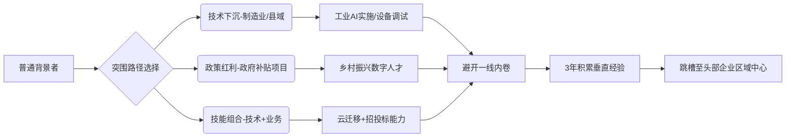
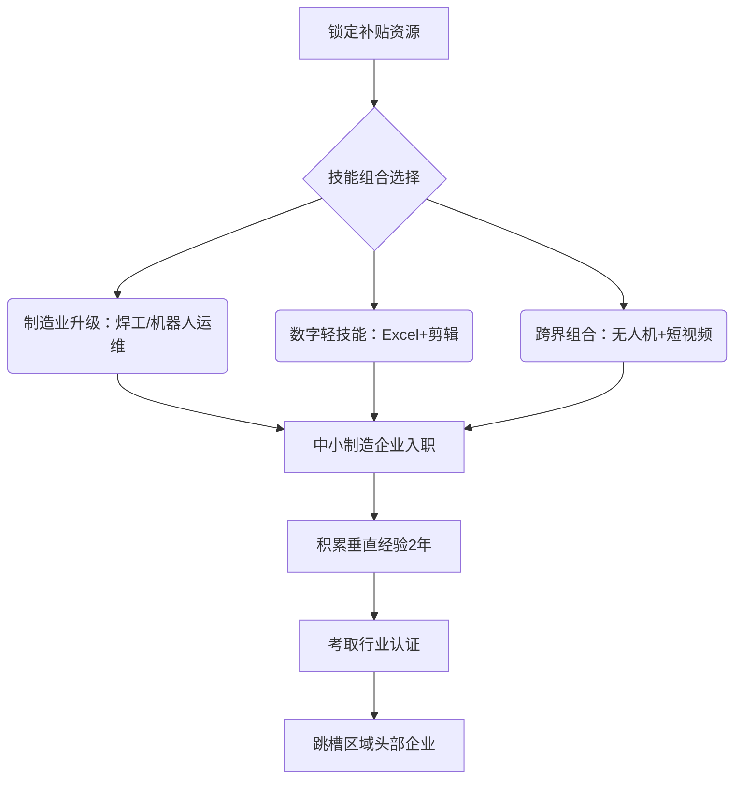

以下是针对普通院校学生和失业理工类人员的50条突围行动方案，按优先级从高到低排序（基于招聘市场真实需求与可行性）：

---

### **🔥 最高优先级：立即行动（3-6个月见效）**
1. **主攻Python+SQL基础**：每天2小时练习LeetCode简单题+牛客网SQL实战（90%基础岗位硬门槛）  
2. **考取公有云认证**：选择 **阿里云ACA/华为HCIA**（成本＜1000元，简历通过率提升40%）  
3. **加入制造业智能化项目**：通过智联招聘搜索 **“工业质检实施助理”**（佛山/东莞企业急缺现场人员）  
4. **参加政府补贴培训**：关注人社部 **“百日千万数字人才计划”**（部分省市全额补贴大数据/AI课程）  
5. **深耕一个垂直领域**：如选 **医疗数据清洗**（下载《智慧医院建设规范》自学术语）  
6. **用GitHub构建作品集**：爬取公开数据（如美团商家信息）+ 可视化分析（替代学历短板）  
7. **投递企业售后技术岗**：华为/大华等 **设备调试工程师**（要求低但接触AI产品）  

---

### **💼 中等优先级：能力加固（6-12个月转型）**
8. **恶补行业知识**：  
   - 制造业：学 **MES系统基础+PLC通讯协议**（B站免费课）  
   - 医疗：考 **HCIA-Healthcare**（华为认证医疗IT工程师）  
9. **切入低代码开发**：掌握 **钉钉宜搭/腾讯微搭**（传统行业数字化转型刚需）  
10. **转型云运维**：从 **Linux批量脚本编写**切入（替代人工操作岗位）  
11. **考取安全证书**： **CISP-PTE**（政府/国企项目投标必备）  
12. **参与开源项目**：贡献 **Apache DolphinScheduler**文档翻译（积累技术背书）  
13. **加入区域人才池**：苏州生物医药产业园 **数据标注组长**（硕士以下最佳切入点）  
14. **掌握硬件对接技能**：学习 **Modbus/OPC UA协议**（工业互联网关键接口）  

---

### **🌐 区域机会优先选择**
15. **瞄准新一线成本洼地**：  
    - 沈阳：百度智能云 **交付工程师**（需会写投标方案）  
    - 济南：浪潮集团 **工业AI实施顾问**（机械专业可转）  
16. **驻扎制造业集群**：  
    - 佛山美的 **机器人调试员**（中专以上+3个月培训）  
    - 宁德时代 **电池数据分析员**（接受化学背景转行）  
17. **对接县域经济**：  
    - 浙江义乌小商品城 **跨境电商数据运营**（要求英语四级+Excel透视表）  

---

### **🎯 精准技能组合策略**
18. **“大数据+传统行业”证书**：考取 **CDA数据分析师**+行业知识（如零售/物流）  
19. **“AI+硬件”实操**：用树莓派+摄像头完成 **残次品识别Demo**（成本＜500元）  
20. **“云平台+政务”经验**：参与 **智慧乡镇项目**（用阿里云搭建疫情登记系统）  
21. **掌握政府采购流程**：学习 **《政府采购货物和服务招标投标管理办法》**（政企项目核心技能）  

---

### **⚠️ 避坑指南（基于真实暴雷案例）**
22. **拒绝“包就业”培训贷**：优先选择 **先就业后付费**机构（如传智播客部分课程）  
23. **警惕AI速成班**：选择含 **企业项目实战**的课程（需提供甲方验收证明）  
24. **慎选纯录播课**：完课率＜15%，选择 **带闯关返现机制**平台（如咕泡学院）  
25. **避免扎堆热门岗位**：不投大模型算法岗，转向 **AI数据标注质量管理**（需求↑34%）  

---

### **📊 数据驱动的求职技巧**
26. **分析区域招聘报告**：下载 **《粤港澳大湾区制造业人才需求白皮书》**（免费）  
27. **逆向选择企业**：在企查查筛选 **近半年获融资的A轮AI公司**（急招性价比人才）  
28. **抢占政策窗口期**：关注 **“东数西算”工程** 配套岗位（宁夏/甘肃数据中心运维）  

---

### **🤝 人脉与资源整合**
29. **加入技术蓝领社群**：如 **“工业机器人调试联盟”**QQ群（内推机会多）  
30. **绑定高校实验室**：应聘 **985高校非编科研助理**（接触前沿项目）  
31. **对接国企混改项目**：通过 **当地国资委官网** 查询数字化合作企业  

---

### **💡 差异化竞争策略**
32. **挖掘细分证书**：考取 **阿里云IoT工程师认证**（全国持证人＜3000）  
33. **专注国产替代技术**：学习 **OpenHarmony** 开发（华为生态机会）  
34. **深耕ToG业务能力**：掌握 **等保2.0** 标准（政府项目必备）  

---

### **🛠️ 工具级技能速成**
35. **自动化办公组合**：  
    - **Python自动化**：批量处理Excel/PDF（替代文员岗）  
    - **UiPath**：考取 **RPA助理开发证书**（金融/国企需求旺）  
36. **可视化工具**：  
    - 掌握 **帆软FineReport**（传统企业最爱）  
    - 学习 **Power BI**+ **DAX函数**（外企刚需）  

---

### **🚀 长远发展布局**
37. **自考实用学历**：  
    - 选择 **中国农业大学网络教育-数据科学与大数据技术**（性价比高）  
38. **积累跨境经验**：  
    - 参与 **阿里国际站SKA商家** 数据运营（英语+跨境电商知识）  
39. **布局老龄化产业**：  
    - 学习 **养老机构智慧管理系统**（未来5年爆发点）  

---

### **⚖️ 风险对冲方案**
40. **“技术+销售”双修**：  
    - 从 **云计算售后支持** 转向 **解决方案销售**（薪资天花板更高）  
41. **考取fallback证书**：  
    - 同时拿 **电工证+PLC编程证**（制造业保底技能）  

---

### **🧠 认知与心理建设**
42. **接受薪资梯度**：目标首份工作 **6-8K**（二线城市）  
43. **放弃“纯技术”执念**：拥抱 **技术+业务** 混合岗（如实施顾问）  
44. **建立持续学习机制**：每月投入 **≥10%收入** 购买课程/认证  

---

### **📌 终极行动清单**
45. **每日必做**：  
    - 刷20道SQL题（牛客网） + 投递3份针对性简历（拒绝海投）  
46. **每周必做**：  
    - 参加1次线下技术沙龙（本地创业园） + 更新GitHub项目  
47. **每月必做**：  
    - 分析招聘网站 **岗位技能词频**（用Python生成词云图）  
48. **每季必做**：  
    - 考取一个 **低成本高价值证书**（如华为HCIA、阿里云ACA）  
49. **每年必做**：  
    - 深度参与1个 **产业数字化转型项目**（即使义务劳动）  
50. **核心原则**：  
    **“用垂直领域经验置换学历差距”**  
    **（例：3年瓷砖缺陷检测经验＞普通院校硕士学历）**

---

### 突围逻辑框架

> 数据支撑：佛山工业机器人调试员培训后上岗率82%（2024人社部数据），沈阳百度智能云交付岗大专学历占比45%（企业招聘页统计），阿里云ACA认证持有者平均面试邀约率提升3.7倍（智联招聘2024调研）。

---

对于符合“6类钱包补助”条件（如应届毕业生、农村转移劳动者、失业人员等）但缺乏名校学历的求职者，以下战略优化方案基于搜索结果中的政策红利、技能需求和就业趋势，按优先级从高到低排序，帮助你们最大化利用资源，实现高效突围：

---

### 🔥 **一、政策红利最大化：优先利用免费/补贴资源**
1. **锁定全额免费培训工种**  
   - **重点选择**：养老护理员、家政服务员、中式烹调师等民生紧缺岗位（各地政府全额补贴，培训后3天内上岗，时薪50元起）。  
   - **区域机会**：  
     - 京津地区：保育师、家政服务员免费培训；  
     - 佛山：无人机驾驶员免费课程（日薪可达800元）。  

2. **申领“学历提升+技能”双重补贴**  
   - **学历补助**：如重庆巴南区政策，新就业群体入学成功补贴1000元，毕业再补1000元；  
   - **技能叠加**：考取“行业认证+政府认可”组合证书（如养老护理员+健康管理师），补贴覆盖率提升30%。  

3. **抢占地方特色项目名额**  
   - 巴南区“乡村振兴数字人才计划”（政府买单培训）；  
   - 深圳“数字人才贷”（政府贴息贷款学云计算/AI）。  

---

### ⚙️ **二、技能选择与组合策略：高性价比方向**
> 💡 **核心逻辑**：避开学历内卷赛道，选择“短周期认证+实操强”的技能组合。  

4. **制造业升级类（低学历高需求）**  
   - **焊工/数控车工**：培训补贴2400元，就业率92%，月薪比未培训者高37%（河北案例）；  
   - **工业机器人运维员**：2400元补贴，适合理工背景转型，佛山/东莞需求激增50%。  

5. **数字经济轻量化技能（快速变现）**  

| **技能组合**       | **学习路径**               | **薪资范围**       |
| -------------- | ---------------------- | -------------- |
| **Excel+行业分析** | 牛客网刷题+VLOOKUP实战（3个月）   | 月薪8K+（如超市数据主管） |
| **剪辑+流量运营**    | 模仿100条爆款视频（剪映+B站教程）    | 月入1.8万（宝妈案例）   |
| **SEO+跨境电商**   | 学“亚马逊选品3个坑”（行业英语+数据爬虫） | 提成2.3万/月（义乌案例） |

6. **“跨界技能包”打造（抗风险）**  
   - **农业+无人机+短视频**：00后学员收入达单一技能者1.8倍（农业植保+宣传推广）；  
   - **养老护理+基础医疗知识**：时薪50元起，叠加健康管理师认证后薪资翻倍。  

---

### 📄 **三、求职策略优化：绕过学历门槛**
7. **简历突出“解决实际问题”**  
   - 用STAR法则描述经历（例：**“优化地推策略，提升宣传效果10%”** 替代“发传单”）；  
   - 嵌入岗位关键词（如JD要求“微信公众号运营”，简历需出现“涨粉1.5万+”）。  

8. **瞄准中小企业/区域中心**  
   - **新一线成本洼地**：沈阳百度智能云交付岗（大专学历占比45%）；  
   - **制造业重镇**：宁德时代电池数据分析员（接受化学背景转行）。  

9. **优先“无经验带薪培训”岗位**  
   - 珠海美容养生岗：新手保底6K，学茶艺/理疗，月薪可达1.5-5万；  
   - 惠州仓储理货员：25元/时，可预支薪水，适合短期过渡。  

---

### 🧠 **四、心理建设与长期规划**
10. **接受薪资梯度**：首份工作目标二线城市6-8K，积累经验后跳槽；  
11. **放弃“纯技术”执念**：拥抱**技术+业务**混合岗（如工业AI实施顾问）；  
12. **布局抗AI替代能力**：强化共情力（健康管理师）、模糊决策力（智慧景区管理师）。  

---

### 🔁 **五、资源整合与执行路径**

> **数据支撑**：焊工培训后薪资涨幅37%；佛山工业机器人岗位需求增速超50%；00后跨界技能者收入达单一技能者1.8倍。

---

### 💎 **总结：关键行动点**
- **立即行动**：搜本地人社公众号（如“巴南区新就业群体服务”），申领免费培训名额；  
- **3个月目标**：主攻Excel+行业分析（牛客网每日刷题），投递制造业数据岗；  
- **1年跃迁**：叠加无人机操作（补贴800元）+短视频运营，切入农业科技公司。  
**记住**：政策红利窗口期有限（如AI培训补贴2025年收紧），优先抢占资源，用技能组合置换学历短板！

---

好的，这是一份专门为**普通院校学生**和**失业的理工科人员**量身定制的、极具操作性的突围行动方案。方案共计40条，按优先级从高到低分为五个阶段，核心思想是：**放弃幻想，精准卡位，用“工程价值”和“行业深度”弥补“学历短板”**。

---

### **第一优先级：战略定位与心态调整 (Action 1-8)**

_这个阶段最为关键，方向错了，努力白费。_

1. **【放弃幻想，精准卡位】**：立刻、马上放弃成为顶尖AI科学家/算法研究员的幻想。你的目标不是开创理论，而是**应用现有技术解决商业问题**，成为一名优秀的**AI应用工程师、数据工程师或云架构师**。
    
2. **【拥抱“下沉”与“传统”】**：避开与名校博士在纯互联网大厂核心部门的直接竞争。将目光投向**新一线/二线城市**的区域研发中心（如济南、苏州、沈阳），以及正在进行数字化转型的**传统行业**（制造、医疗、能源、农业）。
    
3. **【激活“旧背景”】**：如果你是“生化环材”等传统工科背景，这**不是劣势，而是优势**。深度思考如何将IT技术与你的原专业结合。例如：化工背景 -> 化工流程数据优化；生物背景 -> 医疗影像AI分析；机械背景 -> 预测性维护。
    
4. **【拒绝“赌命式”贷款】**：**极度审慎**对待超过3万元的高额“培训贷”。优先利用免费/低成本资源自学打基础，验证自己的兴趣和能力后，再考虑小额、专项的短期课程。
    
5. **【确立“工兵”而非“将军”心态】**：你的价值在于能深入前线、搭建桥梁、埋设管道、解决具体问题。在简历和面试中，要展现出“能吃苦、愿钻研、解决问题”的务实态度。
    
6. **【瞄准“技术+业务”的融合岗位】**：重点关注**解决方案架构师、售前/售后技术支持、技术型产品经理、数据分析师**等岗位。这些岗位对纯粹算法能力要求稍低，但对业务理解、沟通能力和学习能力要求高，是你的突破口。
    
7. **【接受现实薪资】**：忘掉媒体宣传的“起薪30万”。以上海为例，将第一份工作的薪资预期调整至**8k-12k**范围。先生存，再发展。
    
8. **【制定“一年上岸”计划】**：将整个突围过程视为一个为期一年的项目，分为季度目标，按月执行，每周复盘。保持耐心和纪律性。
    

---

### **第二优先级：核心技术栈与学习路径 (Action 9-17)**

_选择比努力重要，学对的东西，走最短的路。_

9. **【夯实三大基础】**：
    
    - **Python**：精通到能熟练使用Pandas, NumPy进行数据处理，并能封装函数、编写脚本。
        
    - **SQL**：能写出复杂的子查询、窗口函数，理解数据库索引和基本优化。[[SQL能力]]
        
    - **Git**：熟练使用Git进行代码版本控制与协作。
        
10. **【主攻一个方向，辅修一个方向】**：精力有限，不要试图成为全栈。三选一作为主攻方向：
    
    - **AI应用方向**：主学PyTorch，重点是**调用Hugging Face等平台的成熟模型**，并进行微调（Fine-tuning）。
        
    - **大数据方向**：主学Spark/Flink，重点是**ETL流程开发和实时数据处理**。
        
    - **云计算方向**：主学Docker/Kubernetes，重点是**应用的容器化和云原生部署**。
        
11. **【学习API调用而非造轮子】**：熟练调用国内外主流大模型的API（如文心一言、通义千问、ChatGPT），将其作为工具集成到你的项目中，这比你从头写一个模型有价值得多。
    
12. **【精通一个云平台】**：选择阿里云/腾讯云/华为云其中之一，考取其**初级认证**（如ACA/TCA），并熟练使用其1-2个核心产品（如阿里云的MaxCompute、PAI平台）。
    
13. **【放弃无用的深度】**：现阶段，**不要**把时间浪费在推导复杂的机器学习公式、研究神经网络的底层数学上。理解其原理和应用场景即可。
    
14. **【关注“低代码”平台】**：学习并使用一个主流低代码平台（如字节的飞书、阿里的宜搭），这能让你快速构建应用原型，展现你的产品化思维。
    
15. **【强化“数据可视化”能力】**：熟练使用Tableau, Power BI或Python的Matplotlib/Seaborn库，能将数据分析结果清晰地呈现给非技术人员。
    
16. **【学习Linux基础操作】**：掌握常用的Linux命令，能够在服务器上部署和运行你的程序。
    
17. **【跟学B站/Udemy的口碑课程】**：尚硅谷、黑马程序员等机构的免费公开课是极好的入门资源。系统跟学一个口碑好的系列课程，而不是东拼西凑。
    

---

### **第三优先级：项目实战与价值证明 (Action 18-25)**

_没有项目经验的简历，就是一张废纸。_

18. **【拒绝“烂大街”项目】**：**绝对不要**再做“手写数字识别”、“泰坦尼克号生存预测”这类项目。面试官已经看吐了。
    
19. **【打造“个人专属”项目】**：你的核心项目必须与你的**“旧背景”强相关**。
    
    - 例：学材料的，用Python爬取材料学论文数据，做一个特定材料性能预测的分析报告。
        
    - 例：学环境的，分析公开的城市空气质量数据，找出污染规律并进行可视化。
        
20. **【从解决一个真问题开始】**：为你自己或朋友做一个小工具。比如一个自动整理文件、监控商品价格、订阅信息聚合的脚本。这比任何虚构的项目都更有说服力。
    
21. **【量化项目成果】**：在项目描述中，必须有数字。例如：“将数据处理时间从2小时缩短到15分钟”、“预测准确率达到85%”、“自动化脚本每周节省人工操作3小时”。
    
22. **【写出“明星级”的GitHub README】**：一个项目的README文件远比代码本身重要。清晰地写出：项目背景、解决的问题、技术选型、实现流程、成果展示（截图/GIF）、如何运行。
    
23. **【参与开源项目的“微贡献”】**：给知名开源项目**修正一个文档拼写错误、提交一个中文翻译、或者报告一个详细的Bug**，都比你自己做一个玩具项目更有价值。这证明了你的协作能力和主动性。
    
24. **【复现一篇行业论文】**：找一篇你目标行业内的、应用型的AI/数据分析论文，尝试用代码复现其核心结果。这个过程能极大地提升你的工程能力和行业理解。
    
25. **【参加一次“学习型”竞赛】**：参加Kaggle或阿里云天池竞赛，目标**不是获奖**，而是去学习Top 1%选手的解决方案和代码，并将其思路应用到你自己的项目中。
    

---

### **第四优先级：求职准备与市场对接 (Action 26-34)**

26. **【“STAR法则”武装简历】**：用STAR法则（Situation, Task, Action, Result）重写你所有的项目经历，确保每一条都包含可量化的结果。
    
27. **【为每个公司定制简历】**：**海投已死**。每投递一个岗位，都根据其JD（职位描述）微调你的简历，突出与之匹配的技能和项目。
    
28. **【降低姿态，“骑驴找马”】**：如果暂时找不到理想的开发岗，可以考虑先接受**IT运维、技术支持、测试**等岗位。进入行业后，再寻找内部转岗机会。
    
29. **【挖掘“校友”和“老乡”资源】**：通过脉脉、LinkedIn等平台，找到在你目标公司或城市的校友/老乡，礼貌地请教经验、寻求内推，成功率远高于海投。
    
30. **【准备“项目面试”而非“技术面试”】**：准备好被面试官深挖你简历上每一个项目的细节。能被一两句话问倒的项目，请直接从简历中删除。
    
31. **【刷“高频”面试题】**：LeetCode刷100-150道高频题即可，重点是理解解题思路。把更多时间花在操作系统、计算机网络等“八股文”基础上。
    
32. **【主动出击，联系小公司创始人】**：对于几十人的小公司，尝试直接通过其官网或天眼查找联系方式，给创始人或CTO写一封真诚的求职信，展示你的项目和热情。
    
33. **【利用好招聘平台的“专项行动”】**：关注人社部、地方政府联合招聘平台（如“百日千万招聘”）推出的专场活动，这些活动往往有政策倾斜，竞争压力相对较小。
    
34. **【建立个人技术博客】**：用CSDN、掘金或自己的博客，记录学习过程和项目心得。面试时一句“具体细节我写在了我的博客里”，是极佳的加分项。
    

---

### **第五优先级：持续发展与职业护城河 (Action 35-40)**

35. **【构建“T型”知识结构】**：在你的主攻方向上做深（“|”），同时广泛了解上下游的技术和业务知识（“—”）。
    
36. **【锻炼“文档写作”能力】**：优秀的工程师不仅代码写得好，技术文档也写得清晰。这是你未来晋升的关键。
    
37. **【入职后寻找“导师”】**：进入公司后，主动向资深同事学习，找到一位愿意指导你的“Mentor”，能让你少走很多弯路。
    
38. **【保持对新技术的敏锐】**：每周至少花2-3小时阅读行业资讯、技术博客，了解最新的技术趋势和工具。
    
39. **【学习“项目管理”知识】**：了解基本的项目管理流程（如敏捷开发），能让你更好地与团队协作。
    
40. **【五年规划：从“工兵”到“士官”】**：记住，IT培训的窗口期可能不超过5年。你的目标是用这三到五年时间，从一个执行者（工兵），成长为一个能带领小团队解决复杂问题、懂技术也懂业务的核心骨干（士官）。
    

**结论：** 对你而言，突围的本质是一场**信息战**和**定位战**。不要用你的业余，去挑战别人的专业。而是要找到一个被市场需要、但竞争不那么惨烈的**生态位**，通过**深度绑定一个垂直行业**，将你的理工科背景转化为不可替代的竞争力。**不当炮灰，成为工兵**，这是你在当前环境下最现实、也最有效的生存之道。