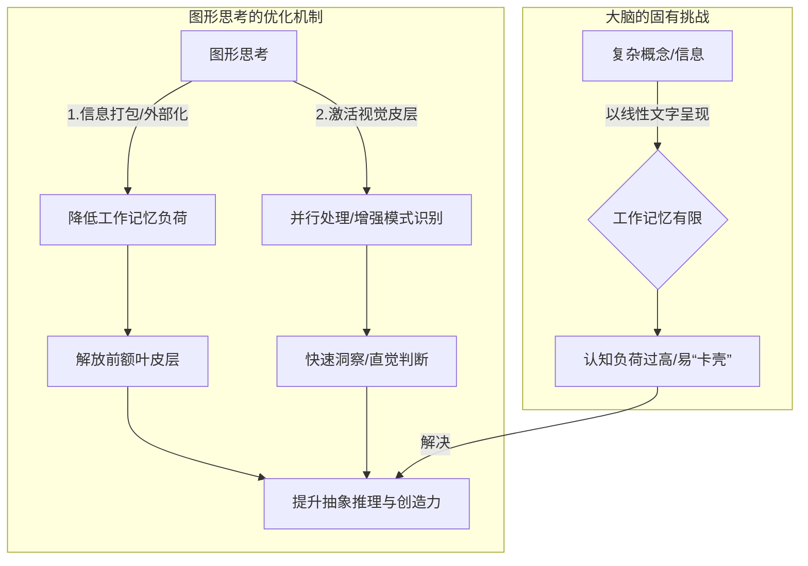
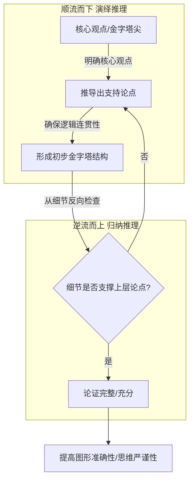
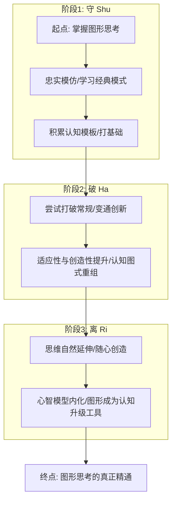
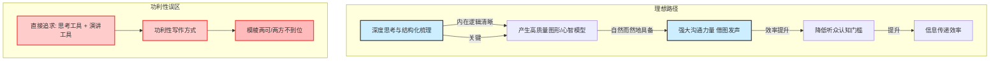

画好金字塔图的技巧在于，首先，要由上至下检查流程的连贯性。检查完之后，再由下至上反向观察是否有不妥之处。通过正反两个方向的分析来提高图形的准确性。

## 深挖图

## 守破离

## 四种问题

## 好设计+低价格 (管理和经验)

## 借图发声

## 有用的都想写——功利性写作不可取

但从经验的角度来说，我又觉得图形首先应该是整理思维的一种思考工具，其次才能成为演讲的工具。
因此，我曾尝试把我想采用的“思考工具”和呼声较高的“演讲工具”两个角度结合起来写作，在经过反复摸索、尝试之后，我发现，这种功利性的写作方式是不可取的。
用这种方式写作，只能写出模棱两可、两方都不到位的内容。因此，经过几次大幅调整，我最终定下以“思考工具”的角度撰写此书，也就是读者们现在看到的内容。

---

### 为什么图形思考能“点亮”大脑？——[[认知负荷]]与[[模式识别]]的优化

从认知神经科学的角度看，图形思考的有效性并非偶然，它深刻根植于我们大脑的[[工作机制]]：

1.  **[[降低认知负荷]]，解放[[工作记忆]]：**
    我们大脑的[[工作记忆]]（Working Memory）容量极其有限，通常只能同时处理7±2个“块”（chunks）的信息。当我们在脑海中处理复杂概念时，如果仅依赖语言文字，这些信息会很快超出工作记忆的负荷，导致我们“卡壳”。而图形，尤其是结构化的图形，能将大量信息[[打包]]成一个可视化的“块”。例如，一张流程图能将整个复杂的业务流程压缩成一个画面，而非一段长文本。这相当于将大量的[[认知运算]]从有限的[[工作记忆]]中**[[外部化]]**，将其“存储”在纸上或屏幕上，从而大大减轻了大脑的负担，解放了[[前额叶皮层]]用于更高级的[[抽象推理]]和[[创造性思维]]。

2.  **[[激活视觉皮层]]，提升[[模式识别]]能力：**
    我们的大脑约30%的神经元参与[[视觉处理]]，视觉系统是高度发达的[[模式识别器]]。相比于需要[[顺序处理]]的文字信息，图形能够被我们的大脑**[[并行处理]]**。当信息以节点、连接、层次、区域等形式呈现时，我们能迅速捕捉到其中的[[结构关系]]、[[趋势]]、[[异常]]和[[潜在关联]]。这种[[模式识别]]能力，是我们在复杂环境中快速做出[[直觉判断]]（[[系统1思维]]）和发现[[非显而易见]][[洞察]]的关键。一张精心绘制的[[思维导图]]，其分支结构能瞬间揭示概念间的[[层级]]和[[关联]]，这比阅读同样内容的文字列表要高效得多。

3.  **促进[[思维的外部化与迭代]]：**
    大脑中的思维往往是混沌且碎片化的。将它们通过图形形式[[外部化]]（Externalization），比如绘制[[草图]]、[[流程图]]、[[概念图]]或[[金字塔图]]，这个过程本身就是一次[[认知重构]]。在绘制的过程中，你会发现逻辑的断裂，概念的模糊，思维的[[盲点]]。这种[[具象化]]的[[反思机制]]，能帮助我们不断[[迭代]]和[[完善]]自己的[[心智模型]]。正如心理学家[[彼得·霍林斯]]在《[[学习的艺术]]》中提到的，有效的学习往往伴随着将内在思考外显化，从而能被批判性地审视和改进。

### 核心实践：从[[金字塔原理]]到[[深挖]]与[[借图发声]]

理解了[[图形思考]]的[[认知机制]]，我们便能更好地运用它。这并非简单的“画图”，而是对[[思维过程]]的[[结构化]]与[[视觉化]]。

#### **1. [[金字塔原理]]：构建[[思维的骨架]]与[[逻辑的河流]]**

在组织复杂信息或进行严谨论证时，[[芭芭拉·明托]]的《[[金字塔原理]]》提供了一个强大的[[心智模型]]。其核心在于：任何思想都可归结为一个金字塔结构，越往上越抽象，越往下越具体，且同一层级的思想必须属于同一范畴。

*   **[[顺流而下]]（自上而下）：** 首先，明确你的核心观点（位于金字塔尖）。然后，从上至下推导出支持这一观点的论点，并确保它们之间存在清晰的[[逻辑连贯性]]。这是一种[[演绎推理]]的过程，确保你的论证能够[[顺畅]]地展开。
*   **[[逆流而上]]（自下而上）：** 绘制完成后，从底层细节出发，反向检查这些细节是否能有效支撑上层论点，直到金字塔尖的核心观点。这是一种[[归纳推理]]的过程，用于检验[[论证的完整性]]和[[支撑的充分性]]。

这种正反向的[[双向检验]]，如同大脑在构建[[知识网络]]时的[[自组织]]和[[自校正]]机制。它迫使我们不断审视[[逻辑链条]]的坚固性，确保不仅“是什么”清晰，更“为什么”站得住脚。

#### **2. [[深挖图]]：穿透表象，探寻[[问题根源]]**

当面对一个看似简单的现象却无法解决的问题时，往往是因为我们停留在表层。绘制“[[深挖图]]”——这可能是一种[[因果图]]、[[鱼骨图]]或是层层展开的[[决策树]]——能帮助我们进行[[多级分解]]。

例如，在分析[[四种问题类型]]时（复杂、简单、混乱、棘手等分类，尽管原文未明确给出具体分类，但暗含此意），“深挖图”能帮助我们将一个棘手的问题逐步拆解为多个可管理、可分析的子问题，直至找到其[[根本原因]]。这种[[结构化分解]]的思维，是解决[[复杂系统]]问题的关键。它强迫我们对抗大脑[[认知吝啬]]的本能，投入[[系统2思维]]资源，深入挖掘那些[[非显而易见]]的[[潜在因素]]。

#### **3. [[守破离]]：从模仿到创新，图形思考的[[成长路径]]**

日本传统文化中的“[[守破离]]”原则，同样适用于[[图形思考]]的掌握过程。

*   **守 (Shu):** 忠实模仿和学习经典的图形模式、模板和最佳实践。例如，学习[[UML]]图、[[泳道图]]、[[决策矩阵]]等标准表示法。这是我们大脑积累[[认知模板]]的过程。
*   **破 (Ha):** 在掌握基础后，开始尝试打破常规，结合实际问题进行变通和创新，探索新的表达方式。这是一种[[适应性]]和[[创造性]]的体现，你开始将不同[[认知图式]]进行重组。
*   **离 (Ri):** 最终，图形表达成为你思维的自然延伸，你不再受任何特定规则的束缚，可以随心所欲地创造出最能表达自己复杂思想的图形。这标志着[[心智模型]]的完全内化，图形真正成为了你[[认知升级]]的工具。

这部分描述了图形思考如何通过[[外部化]]信息、[[降低工作记忆负荷]]和[[激活视觉皮层]]来提升思维效率。我们可以用一个流程图来概括这个认知优化过程。

