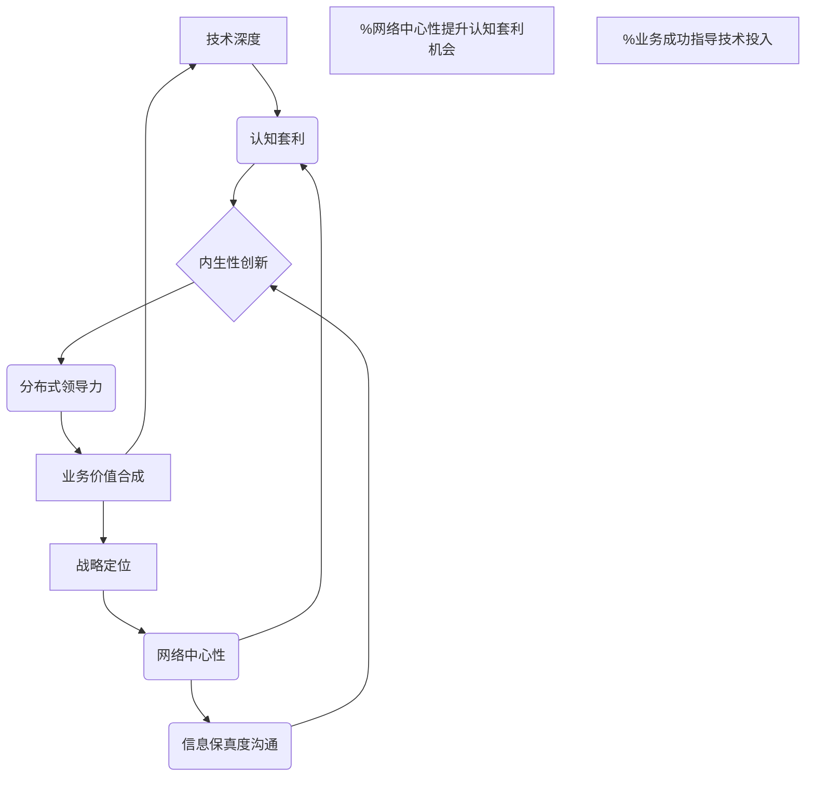
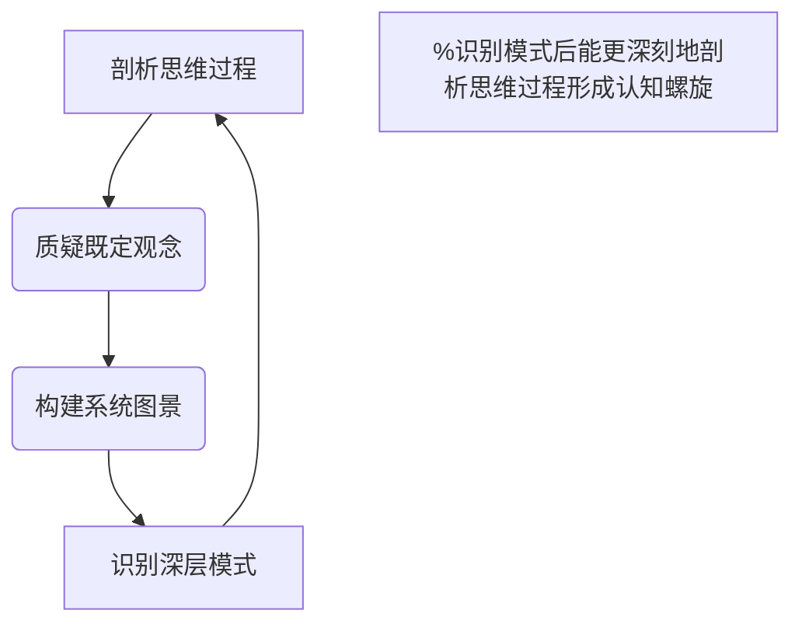

## 深化认知：构建知识图式的多维透视

仅仅罗列概念并建立链接，就像是绘制了一张城市的地图，上面有街道、建筑的名称。但要理解这座城市的“逻辑”和“层次”，我们需要知道交通如何流转、经济如何运作、文化如何形成，以及不同区域如何相互依赖和影响。这需要我们从以下几个维度提升认知：

### 1. 剖析思维过程：超越线性关联，洞察认知偏见

我们的大脑习惯于线性思考和归类，这在初期整理信息时效率很高。但这种思维模式也可能隐藏着深层的假设和认知偏差，阻碍我们看到更复杂的动态关系。

**挑战 Sam：**
当你罗列出[[技术深度]]、[[高信息保真度沟通]]等五点“核心洞见”时，你的潜意识是否将它们视为相对独立的、并列的要素？你认为它们之间的连接仅仅是“同属一个主题”吗？我们是否忽略了它们之间更复杂的**因果、支撑、转化**关系？

**案例剖析：重构“技术深度”的价值转化路径**

以你的笔记中提到的“[[技术深度]]的[[业务价值合成]]”为例。传统思维可能认为：“我的技术能力很强” → “我写出好代码” → “项目成功”。这是一种线性的、效率导向的思维。

*   **剖析旧假设：** 这个路径隐含的假设是：技术能力可以直接等同于业务价值，且价值转化是自动完成的。这是一种“产品中心”或“技术中心”的思维惯性，忽视了“人”和“组织”的桥梁作用。
*   **揭示新机制（逻辑与层次深化）：** 真正的价值转化是一个复杂的多层过程，需要深层剖析：
    1.  **第一层（技术基础）：** 技术深度 ($T_D$) - 你掌握的算法、架构等。
    2.  **第二层（认知转化）：** 领域模型理解 ($D_M$) 与隐含假设识别 ($I_A$) - 你如何将纯技术语言转化为业务语言，并识别技术方案背后的业务假设。
    3.  **第三层（沟通桥梁）：** 信息保真度沟通 ($C_I$) 与影响力工程 ($I_E$) - 你如何有效地将复杂的认知转化为非技术利益相关者可理解和接受的决策输入。
    4.  **第四层（价值输出）：** 可量化业务指标映射 ($B_M$) - 你的技术贡献如何直接关联到营收、留存等具体业务成果。
    5.  **第五层（系统反馈）：** 业务成功反哺技术战略 ($F_{BS}$) - 业务的成功又会指导技术投入方向，形成正向循环。

现在，你的笔记可以这样描绘这个**逻辑链条与层次结构**：

 $\xrightarrow{\text{认知转化: [[领域模型]], [[隐含假设]]}}$ **技术洞察** $\xrightarrow{\text{沟通转化: [[信息保真度沟通]], [[影响力工程]]}}$ **业务共识** $\xrightarrow{\text{价值实现: [[业务价值合成]]}}$ **业务增长** $\xrightarrow{\text{系统反馈: [[战略定位]]}}$ **技术战略强化**

在笔记中，你可以通过增加“链接类型”的标注（例如，用不同的箭头、颜色，或者在链接旁边简短说明其关系），来深化这种逻辑：

-   [[任务拆解]] $\xrightarrow{\text{可能导致}}$ [[内卷效率]] $\xrightarrow{\text{但可能忽视}}$ [[认知熵增]]
-   [[网络中心性]] $\xrightarrow{\text{提升}}$ [[信息保真度沟通]] $\xrightarrow{\text{促进}}$ [[协同效应]]

这种显性化的关系标注，能帮助你看到更深层次的因果机制和潜在风险。

### 3. 构建系统图景：描绘动态循环，识别关键杠杆点

单一技术点或知识点往往是某个更大系统中的一个组件。要理解其真正的价值和影响，必须将其置于宏大的系统环境中审视，识别其与其他组件的相互作用，以及形成的正负反馈循环。

**挑战 Sam：**
你的“核心洞见”中的五个点，它们之间是孤立的吗？还是相互依赖，甚至构成了一个动态的系统？例如，[[认知套利]]的能力如何影响[[内生性创新]]？[[网络中心性]]又如何加速[[分布式领导力]]的形成？

**案例剖析：学习路径中的“认知资本”循环系统**

我们可以将你的整个[[阶段性成果驱动的学习路径]]看作一个“认知资本增值与影响力构建”的系统。

*   **构建系统图景：**
    *   **投入：** 你的[[技术深度]]和[[元学习能力]]（用于[[认知套利]]）。
    *   **加工/转化：**
        *   通过[[信息保真度沟通]]和[[影响力工程]]，将技术洞见转化为可理解的价值。
        *   通过[[内生性创新]]和[[分布式领导力]]，将个人贡献扩展为组织价值。
    *   **输出：** [[业务价值合成]]、[[组织韧性]]、[[系统性杠杆]]（你的[[战略定位]]）。
    *   **反馈：** 成功带来的[[网络中心性]]和更强的[[思想领导力]]，反过来会提升你的[[认知套利]]能力和[[技术深度]]的有效性。

这个系统可以通过一个简化的**因果循环图**来表示：

通过绘制这样的系统图，你不再是看单个点，而是看到了一个**动态的、相互强化的增值循环**。你会发现[[网络中心性]]不仅是结果，更是促进[[认知套利]]和[[信息保真度沟通]]的关键**杠杆点**。这种深层模式的识别，能够帮助你从“解决问题”（优化某个点）到“改变系统”（找到系统的杠杆点并施加影响）。

### 4. 识别深层模式：提炼元规律，实现“从问题到系统”的飞跃

最高层次的认知，是能够从纷繁复杂的现象中，提炼出普遍适用的**深层模式**或**元规律**。这些模式超越了特定领域，揭示了事物运行的底层逻辑。

*   **提炼元规律：** 无论是个人的技能提升、团队协作还是组织变革，其成功的深层模式都包含：
    1.  **输入与重构：** 识别现有的“资本”（如技术知识、经验），并进行[[动态能力重构]]和[[交叉学科应用]]（即[[认知套利]]），将其转化为更高价值的“认知资本”。
    2.  **摩擦与优化：** 识别并减少系统中的“摩擦”（如[[信息不对称]]、[[认知熵增]]），通过[[高信息保真度沟通]]和[[影响力工程]]来优化价值传递。
    3.  **网络与杠杆：** 从个体贡献转向通过构建[[网络中心性]]和[[分布式领导力]]，实现[[系统性杠杆]]效应，将个人影响力放大为组织影响力。
    4.  **内生与涌现：** 创造一个能够[[内生性创新]]、自组织和价值涌现的环境，而非仅仅执行外部指令。

这个“认知资本转化”的模式，不仅仅适用于技术领导力，它同样适用于：
*   **个人成长：** 你如何将学习的“知识点”转化为“解决问题的能力”，再到“创造新范式的能力”。
*   **产品开发：** 如何从“满足用户需求”到“引领用户需求”，再到“创造新的市场和生态系统”。
*   **战略制定：** 如何从“分析当前市场”到“预测未来趋势”，再到“塑形行业格局”。

通过在笔记中明确地提炼出这些“元规律”，你的知识图式将不再停留在“What”（是什么）和“How”（怎么做）的层面，而是抵达“Why”（为什么）和“What if”（如果……会怎样）的哲学高度。它能帮助你实现从“解决问题”到“改变系统”的思维跃迁。

---

## 实践建议：将洞见融入笔记实践

为了在你的Obsidian笔记中实现上述的逻辑性和层次感，你可以尝试以下实践策略：

1.  **明确链接类型：**
    *   **语法约定：** 不仅仅是`[[链接]]`，你可以在链接后用括号或特殊符号注明关系，例如：
        *   `[[技术深度]] (支撑) [[业务价值合成]]`
        *   `[[内生性创新]] (导致) [[分布式领导力]]`
        *   `[[认知套利]] (是...的前提) [[交叉学科应用]]`
    *   **属性/标签：** 如果你使用Obsidian的属性功能，可以为链接添加属性，如 `link-type:: causal`。
2.  **可视化思考路径：**
    *   **流程图/概念图：** 在笔记中直接嵌入 Mermaid 语法或使用 Excalidraw 插件绘制系统图、流程图和因果循环图。这比文字更能直观展现逻辑关系。
    *   **层级缩进：** 使用不同的Markdown标题级别（`#`, `##`, `###`）和列表缩进，来明确概念的层级和包含关系。
3.  **引入“思维模型”概念：**
    *   专门创建像[[认知资本转化模式]]、[[系统性杠杆心智模型]]这样的笔记，作为你的元规律集合。然后在具体案例中链接并引用它们，形成“实例-模式-元规律”的层次结构。
4.  **定期反思与迭代：**
    *   不要指望一次性就能构建完美。每次回顾笔记时，问自己：
        *   “这里有什么隐含的假设？”
        *   “这个概念与其他概念的因果关系是什么？”
        *   “它在哪个更大的系统中发挥作用？”
        *   “它背后有没有更深层的通用模式？”
    *   利用Obsidian的Graph View，观察你的链接图谱。当看到某个节点过于孤立，或者某些集群缺乏外部连接时，这可能是你进行深层思考和补充逻辑的机会。

*   **揭示更深层逻辑（认知进阶的层次性）：** 实际上，这四个维度并非简单的并列关系，它们代表了认知深度的**逐步递进**和**迭代螺旋上升**。它们构成了一个从**微观分析**到**宏观整合**，再到**模式抽象**的认知周期：
    1.  **起点：剖析思维过程** - 这是对当前认知状态的“内省”，是任何深度思考的第一步，旨在识别自身的局限。
    2.  **深化：质疑既定观念** - 在内省的基础上，主动挑战外部的、已有的知识结构和接受模式，打破固有框架。
    3.  **整合：构建系统图景** - 在清除内部偏差和外部限制后，将碎片化认知整合为整体，看到连接和动态。
    4.  **升华：识别深层模式** - 从整合的系统图中提炼出普遍适用的元规律，实现认知的高度抽象和迁移。

因此，与其说是“四个维度”，不如说是“四层认知跃迁”，或一个不断深化的**认知循环**。

### 3. 构建笔记的系统图景：绘制“认知螺旋”的动态循环

这四个维度本身就构成了一个动态的认知系统。它们并非孤立，而是相互依赖、相互促进，形成一个不断深化的“认知螺旋”。

*   **系统构成元素：** 剖析思维 ($P_T$), 质疑观念 ($Q_C$), 构建系统 ($B_S$), 识别模式 ($I_P$).
*   **动态交互：**
    *   $P_T \rightarrow Q_C$: 剖析思维中的偏见和假设，为质疑既定观念提供了出发点。
    *   $Q_C \rightarrow B_S$: 质疑旧观念，打破旧框架，为构建新的系统图景创造了空间。
    *   $B_S \rightarrow I_P$: 在完整的系统图景中，更容易识别出深层的运行模式和元规律。
    *   $I_P \rightarrow P_T$: 识别出的深层模式反过来会改变我们的思维模式，让我们能更深刻地剖析自身的假设和偏见，从而开启新一轮的认知深化。

这个过程是螺旋上升的，每一次循环都会使对问题的理解更深一层，对知识图谱的构建更具洞察力。

**笔记自身的因果循环图（作为本笔记的“系统图景”）:**

*   **关键杠杆点：** 这个系统中的每个环节都是关键，但“识别深层模式”尤其重要，因为它提供了最高层次的抽象，能够反过来重塑整个思维过程，实现真正的“认知跃迁”。

### 4. 识别笔记的深层模式：提炼“认知重塑框架”

如果说这篇笔记是在教你“如何让笔记更有逻辑层次”，那么它本身所体现的**最深层模式**，其实是一种通用的 **“认知重塑与价值创造框架”**。

*   **元规律提炼：** 无论面对任何复杂问题、任何学习主题、任何决策场景，我们都可以运用这个框架：
    1.  **内省与清除（Identify & Clear）：** 从自身（思维）或现有（信息）的表象开始，识别并清除噪音、偏见和无效的连接。
    2.  **解构与重构（Deconstruct & Reconstruct）：** 挑战既定，不满足于表面联系，主动解构现有结构，并以更系统、更动态的方式进行重构。
    3.  **整合与涌现（Integrate & Emerge）：** 将孤立的要素整合为有机的系统，从中观察到新的、涌现的特性和价值。
    4.  **抽象与迁移（Abstract & Transfer）：** 从特定案例和系统中提炼出普适的原理和模式，使其知识具备跨领域迁移和指导新实践的能力。

这个模式并不仅限于“笔记组织”，它是一种普适的**高阶思维模型**，可以应用于：
*   **产品创新：** 从用户痛点（剖析思维）到打破现有解决方案（质疑观念），再到构建全新的产品生态（构建系统），最终形成可复制的创新方法论（识别深层模式）。
*   **个人职业发展：** 从自我能力评估（剖析思维）到挑战职业路径限制（质疑观念），再到构建个人发展生态圈（构建系统），最终提炼出个人核心竞争力模式（识别深层模式）。

---

## **【思维黑箱】为什么你的笔记越记越笨？从“连接点”到“系统图”，构建真正高手的知识体系**

**(视频开始)**

### **(黄金15秒开场白)**

(镜头前，我面带微笑，面前放着一本摊开的、画满了链接线的笔记本)

哎，同学们好，我是你们的思维黑箱。

大家看我这本笔记啊，密密麻麻，各种概念连来连去，看起来是不是特别厉害？很多同学现在都用Obsidian这样的工具，建立了庞大的知识网络。

但你有没有过这样的感觉：**笔记记了一大堆，链接拉了上百条，但感觉自己好像并没变多聪明，解决问题的时候，脑子还是一团浆糊。**

这是为什么呢？难道是我们不够努力吗？

哎，今天我们就来聊聊这个核心问题。我们大多数人啊，只是在构建一张“知识的平面地图”，而真正的高手，是在脑中构建一座“知识的立体城市”。这其中的差别，就是从业余到专业的关键。

(我将笔记本合上，推到一边)

今天，咱们就来学习一下，如何给你的知识体系“升维”，从一个“地图测绘员”，变成一个“城市总规划师”。

### **(主体内容)**

#### **### 1. “平面地图”的陷阱：为什么只连接节点还不够？**

我们先来看啊，我们平时记笔记，最常做的是什么？是记录概念，然后把相关的概念用一条线连起来。比如说，我们学物理，把“牛顿第一定律”、“惯性”、“质量”这几个词连起来。

这有没有用呢？有用！这就像我们拿到一张城市地图，知道了故宫在哪儿，天安门在哪儿，王府井在哪儿。这是构建知识的第一步，叫**建立联系**。

但问题是，如果你只做到这一步，你的知识就是“平”的。你只知道“有什么”，但你不知道它们之间**“是怎么相互作用的”**。

打个比方，你知道了这三个地点，但你知道早高峰的时候，从故宫到王府井哪条路最堵吗？你知道这三个地点的商业价值和人流逻辑有什么不同吗？你知道整个城市的地铁系统是怎么规划，来支撑起这些地标的吗？

你看，不知道这些，你就永远只是个游客，而不是一个北京的“老炮儿”。

我们的大脑啊，天生就喜欢走捷径，喜欢线性的、简单的因果关系。比如我们很容易认为“技术好”就能“拿高薪”。但这个思考路径，就忽略了中间无数的复杂环节，比如沟通能力、团队协作、行业趋势等等。这就是**思维的惰性**，它让我们满足于画一张简单的平面地图，而懒得去探索城市地下的交通网络和经济命脉。

所以，构建高手知识体系的第一步，就是**意识到“平面地图”的局限性**，主动去质疑那些看似简单的连接线背后，到底隐藏着什么更深的逻辑。

#### **### 2. “立体城市”的构建：从静态连接到动态系统**

好，那我们怎么从“地图”升级到“城市”呢？关键一步，是**构建系统图景**。

什么叫系统图景？就是你要找到知识节点之间的**因果关系、支撑关系、甚至是相互冲突的关系**，把它们画成一个动态的、流动的系统。

我们还用刚才那个“技术好就能拿高薪”的例子。如果我们用系统思维来分析，它会变成什么样呢？

(我拿起笔，在白板上画一个简易的因果循环图)

你看啊，一个顶尖工程师的价值，可不是一条直线。它更像一个“发动机”系统：

1.  你得有 **“技术深度”**，这是你的燃料。
2.  但光有燃料不行啊，你得通过 **“高水平的沟通”**，把你的技术想法，变成团队能理解的方案。这个过程，就像是把燃料转化成动能。
3.  方案执行得好，产生了 **“业务价值”**，比如公司收入增加了。这是发动机的输出。
4.  最关键的是**反馈回路**：业务成功了，公司会给你更多的资源和信任，让你去研究更深的技术，你的“技术深度”又增加了！同时，你的影响力扩大了，你的沟通也变得更有分量。

(指着白板上的循环图)

大家看，这就不是一条线了，这是一个**正反馈的增强回路**！你的每一个能力，都在为其他能力“加油”。在这个系统里，你才能看到，哦，原来我的“沟通能力”不是一个孤立的软技能，它是这个发动机里一个关键的“变速箱”啊！如果这个变速箱坏了，再好的燃料也输出不了动力。

这就是系统图景的力量。它让你不再关注单个的零件，而是开始思考**整个系统的运转效率和瓶颈所在**。这个瓶颈，我们管它叫 **“杠杆点”**。找到了它，你就能用最小的力气，撬动整个系统的提升。

#### **### 3. 城市规划师的智慧：识别“元规律”，实现跨界打击**

当你能熟练地为你的知识构建“立体城市”之后，就来到了最高境界——成为一个“城市总规划师”。

规划师做什么？他不仅仅是看懂一座城市，他还要能从北京、上海、纽约这些不同的城市中，总结出**城市发展的普遍规律**。这个规律，我们就管它叫 **“元规律”** 或者 **“深层模式”**。

比如，我们刚才分析的那个“个人价值发动机”系统，你仔细一想，这个模式只能用于工程师吗？

不是的！

一个做内容创作的UP主，他的系统是不是也是这样？
“[[内容创作能力]]”（燃料）→“与观众的连接”（转化）→“视频爆火，获得收益”（输出）→“有了更多创作资源和影响力”（反馈）。

一个做投资的人，他的系统是不是也是这样？
“分析研究能力”（燃料）→“说服投委会决策”（转化）→“项目成功退出”（输出）→“获得更高声誉和更多资金”（反馈）。

大家发现没有？虽然领域完全不同，但它们底层的 **“价值创造与增强回路”这个元规律，是相通的！**

一旦你掌握了这种提炼元规律的能力，你就实现了真正的认知飞跃。你学习任何新知识，都不再是从零开始，而是直接去寻找它符合哪个你已知的“元规律”。你的学习速度和洞察力，会呈指数级提升。

这就是为什么很多高手，能快速地在不同领域都取得成功。他们不是天才，他们只是掌握了这种**识别和应用深层模式**的能力，实现了知识的“跨界打击”。

### **(总结)**

好，我们今天聊了如何构建一个更具逻辑和层次的知识体系。

我们知道了，不能只满足于制作一张“平面地图”，简单地连接知识点。
我们得升级成一个“城市建设者”，通过寻找**因果关系和反馈回路**，来构建一个动态的“立体系统”。
最终，我们要努力成为一个“城市总规划师”，从不同的系统中，提炼出能够跨领域迁移的**“元规律”**。

这个过程，本质上就是把我们自己，从一个知识的“消费者”，变成一个知识的“架构师”。这很难，但每前进一步，你看到的风景，都会完全不同。

### **(互动问题)**

那我想问问大家：**在你非常熟悉的某个领域，无论是你的专业、工作还是一个长期的爱好，你有没有发现过什么隐藏在表面之下的“元规律”或“深-层模式”？**

这个规律可能是一个反直-觉的因果关系，或者一个能解释很多现象的底层逻辑。欢迎大家把你的洞察打在评论区，让我们互相学习，看看能不能从彼此的“城市”里，发现共通的“规划法则”。

如果你觉得今天的内容对你有启发，别忘了**一键三连**支持一下。我是你们的思维黑箱，我们下期再见！

**(视频结束)**
