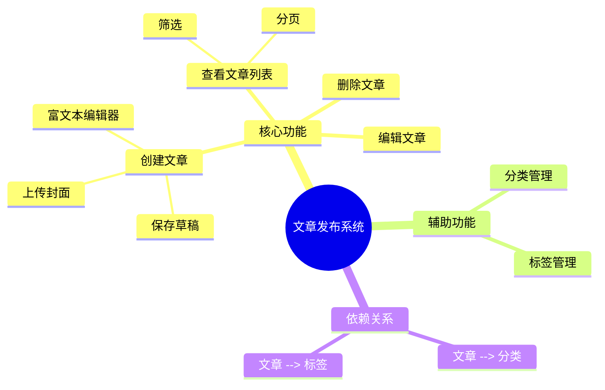

好的，这句话虽然简短，但它包含了一套非常深刻且专业的软件工程和知识管理思想。我们可以从三个层次来理解它：**字面含义**、**深刻含义**，以及**如何具体操作**。

---

### **层次一：字面含义 (What it says)**

这句话直接给出了两个操作指令：

1.  **记录和可视化分解过程：** 在你进行需求分析，把一个大的、模糊的需求拆解成小块、具体的功能点时，不要只在脑子里想。你要用**嵌套列表**（像大纲一样）或者 **Mermaid 图**（用代码生成的图表）这样的工具，把这个“拆解”的**过程本身**记录下来，并让它变得直观可见。
2.  **探讨划分模式：** 单独写一篇笔记，专门用来思考和总结“拆解需求”（即模块划分）的不同**方法和策略**。

---

### **层次二：深刻含义 (What it *really* means)**

这背后是从业余走向专业的关键思维转变。它不仅仅是关于“做笔记”，而是关于如何系统化地思考和管理复杂性。

#### **1. 核心思想一：将“隐性思考”变为“显性产物” (Making Thinking Visible)**

*   **为什么要做这件事？** ==需求分析最大的敌人是**模糊性**和**认知负荷**。==一个大的需求（例如“做一个用户管理系统”）在脑中是一个模糊的、不成形的想法。强行思考它会消耗大量的脑力，而且极易遗漏细节。
*   **“嵌套列表”的作用：** 它强迫你进行**结构化思考 (Structured Thinking)**。当你试图把一个大点拆成几个小点，再把每个小点拆成更小的点时，你就在构建一个逻辑树。这个过程会自然地暴露你思考不周全的地方。这个列表本身，就是一个从混沌到有序的思维产物。它回答了“**what is part of what?**”（什么是什么的一部分？）。
*   **“Mermaid图”的作用：** 它强迫你进行**关系化思考 (Relational Thinking)**。相比于纯粹的层级关系，图表可以展示更丰富的联系，比如流程、依赖关系、用户交互等。例如，一个流程图可以清晰地展示用户从点击“登录”按钮到看到主页的全过程，其中涉及哪些模块的交互。这回答了“**how does A connect to B?**”（A和B是如何连接的？）。

> **深刻洞见：** 这项实践的本质，是**将你大脑中一瞬间的、非结构化的思考过程，固化成一个外部的、可审查、可讨论、可迭代的“思维脚手架”**。这个“脚手架”减轻了你的记忆负担，并成为了你和团队沟通的共同语言。

#### **2. 核心思想二：从“一次性分解”到“模式化分解” (From Action to Strategy)**

*   **为什么要做这件事？** 如果说第一点是“术”，那么这一点就是“道”。新手拿到需求，凭直觉去拆解。而专家知道，拆解的方式（即模块划分的模式）有多种，**不同的划分方式，会从根本上决定未来软件的架构、开发效率、维护成本和团队协作方式。**
*   **“创建专门的笔记”的作用：** 这是一种**元认知 (Metacognition)**，即“对自己思考过程的思考”。当你开始专门总结“模块划分模式”时，你就不再是一个埋头干活的工匠，而是在转变为一个**具备架构师思维的思考者**。你在建立自己的“设计武器库”。
*   **不同的划分模式有哪些？**
    *   **按功能划分 (By Feature):** 例如，一个电商App可以分为“商品模块”、“订单模块”、“用户模块”。这是最直观的方式。
    *   **按领域驱动设计(DDD)划分 (By Domain):** 在复杂业务中，按核心业务领域（如“支付域”、“库存域”、“物流域”）划分，能更好地反映业务本质。
    *   **按技术层次划分 (By Technical Layer):** 分为“表现层(UI)”、“业务逻辑层(BLL)”、“数据访问层(DAL)”。这种划分关心技术实现。
    *   **按用户角色/旅程划分 (By User Role/Journey):** 例如，分为“买家后台”、“卖家后台”、“平台管理员后台”。

> **深刻洞见：** 创建这个笔记的过程，是强迫你**跳出当前项目的具体细节，进行归纳和抽象**。你会开始思考每种划分模式的优缺点、适用场景。当你再遇到新项目时，你就可以像一个经验丰富的医生一样，根据“病症”（需求特性）选择最合适的“疗法”（划分模式），而不是每次都凭感觉“开药”。

---

### **层次三：如何具体操作 (How to do it)**

#### **实践1：在需求分析笔记中可视化分解过程**

假设你的需求是：“开发一个文章发布系统”。

**方法A：使用嵌套列表 (Markdown)**

```markdown
# 需求：文章发布系统

- **核心功能：文章管理**
  - **创建文章**
    - 提供富文本编辑器
    - 支持保存草稿
    - 支持上传封面图片
  - **查看文章列表**
    - 分页显示
    - 显示标题、作者、发布日期
    - 支持按状态（已发布/草稿）筛选
  - **编辑文章**
    - 加载已有文章内容
    - 功能同“创建文章”
  - **删除文章**
    - 提供确认弹窗，防止误删
    - 软删除（标记为已删除）而非物理删除

- **辅助功能：分类与标签**
  - **分类管理**
    - 创建/编辑/删除分类
  - **为文章打标签**
    - 支持从已有标签选择
    - 支持创建新标签
```

**方法B：使用 Mermaid 图 (可视化关系)**

你可以在支持 Mermaid 的笔记软件（如 Obsidian, Typora）中这样写：


*这段代码会自动生成一个思维导图，直观地展示了模块间的层级和依赖关系。*

#### **实践2：创建专门的“模块划分模式”笔记**

你可以创建一篇名为 `[[系统设计：模块划分模式]]` 的笔记，内容结构如下：

```markdown
# 系统设计：模块划分模式

这是一篇用于沉淀和归纳不同系统模块划分策略的笔记。目的是为了在面对新需求时，能有意识地选择最优的分解方式。

---

### 模式一：按功能划分 (Feature-based Decomposition)

- **描述：** 将系统按照用户直接感知到的功能集合进行划分。例如，电商系统分为“商品模块”、“订单模块”。
- **优点：**
  - 非常直观，容易与非技术人员沟通。
  - 便于按功能分配开发任务。
- **缺点：**
  - 可能导致模块间高度耦合（如订单和商品模块都需处理价格）。
  - 对于复杂业务，功能划分可能无法反映深层业务规则。
- **适用场景：**
  - 业务逻辑相对简单的中小型项目。
  - 快速原型开发阶段。

---

### 模式二：按领域驱动设计(DDD)划分 (Domain-based Decomposition)

- **描述：** 围绕核心业务领域（Domain）和限界上下文（Bounded Context）来组织代码和模块。
- **优点：**
  - 高内聚、低耦合，能很好地隔离业务复杂性。
  - 代码结构能清晰地反映业务模型。
- **缺点：**
  - 学习曲线陡峭，需要对业务有深刻理解。
  - 前期设计投入较大。
- **适用场景：**
  - 具有长期演进需求的、业务逻辑复杂的、核心系统。

---

### 模式三：按技术分层划分 (Layer-based Decomposition)

- **描述：** 经典的N层架构，如“表现层-业务逻辑层-数据访问层”。
- **优点：**
  - 关注点分离，各层职责单一。
  - 便于不同技术专长的开发者协作。
- **缺点：**
  - 一次小小的业务变更可能需要同时修改所有层级的代码，效率较低。
- **适用场景：**
  - 作为其他划分模式的补充，在每个模块内部进行分层。

---
```

**总结来说，这句话的深刻含义在于倡导一种“系统化、可视化、模式化”的思维方式来对抗软件开发的内在复杂性。它要求你不仅要完成任务，更要记录下你的思考过程，并从过程中提炼出可复用的策略，最终实现个人能力的跃迁。**