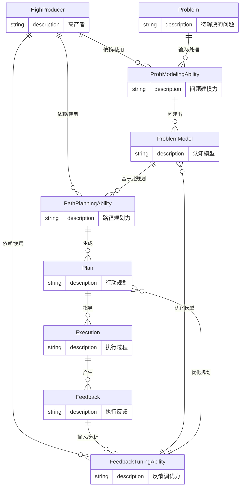

## 论：那些高产者所依凭的心智基石

我们谈论“高产”，往往首先想到的是时间管理工具、工作流程优化或是坚强的意志力。这些固然重要，如同精密的机械需要顺滑的齿轮与强韧的结构。然而，真正驱动这台“高产机器”的，是其深藏于心智深处的认知引擎——那些决定了我们如何看待问题、如何规划行动、以及如何从结果中学习的基础机制。高产，并非简单的“多做”，而是**高效地做正确的事，并在做的过程中不断优化**。这种能力，究其根本，指向的是几种核心的认知能力。经过观察与反思，我认为那些持续达成高产输出的人，其心智模型中常常显露出三种底层认知的强大根基：

### 1. 问题建模力 (Problem Modeling Power)

思考的起点，在于对所面对的“问题”形成清晰而有效的内部表征，即构建一个“模型”。一个高产者面对复杂情境时，并非一头扎进细节的泥沼，而是会本能地尝试在脑海中构建一个简化的、结构化的模型。这涉及到：

*   **识别核心要素与关系：** 能从纷繁的表象中抽离出关键变量、已知条件、未知目标以及它们之间的相互作用机制。这在心理学上可以关联到**认知图谱 (Cognitive Mapping)** 的构建能力，以及对复杂系统**因果链 (Causal Chains)** 的理解。
*   **划定边界与层级：** 明确问题的范围是什么？哪些因素在模型内，哪些在模型外？能否将大问题分解为更小的、可管理的部分？这与我们大脑的**执行功能 (Executive Functions)** 中的**任务分解 (Task Decomposition)** 和**层级规划 (Hierarchical Planning)** 能力紧密相关，通常涉及**前额叶皮层 (Prefrontal Cortex)** 的高级处理。
*   **选择恰当的视角：** 同一个问题，从不同角度看，其模型可能截然不同。一个好的建模者能灵活切换视角，找到最有利于分析和解决的那个。这考验的是心智的灵活性和抽象能力。

一个粗糙或错误的问题模型，会导致后续所有的努力都可能是在错误的方向上打转。反之，一个精准、清晰的模型，就像拥有了一张高精度的导航地图，大大提高了抵达目标的效率。高产者并非不犯错，但他们在开始行动前，花在“理解问题本身”上的心智投入往往更高。

### 2. 路径规划力 (Path Planning Power)

有了问题模型，下一步便是如何从当前状态抵达目标状态——这需要**规划**。路径规划力是将静态的问题模型转化为动态的行动序列的能力。它不仅仅是列一个待办清单：

*   **设定子目标与里程碑：** 大目标往往难以一步实现，需要分解为一系列阶段性、可检验的子目标。这与大脑处理复杂任务时的**目标导向行为 (Goal-Directed Behavior)** 机制一致。
*   **评估可行性与资源：** 考虑可用资源（时间、精力、信息等）以及每一步行动的潜在障碍和风险。这需要对自身能力和外部环境有务实的认知，是**风险评估 (Risk Assessment)** 和**资源分配 (Resource Allocation)** 能力的体现。
*   **生成与比较备选方案：** 通常不止一条路通向罗马。高产者能够快速生成几种可能的行动路径，并根据效率、风险、资源消耗等标准进行比较，选择最优或次优的方案。这依赖于**决策制定 (Decision Making)** 过程，涉及对不同行动后果的模拟和预测。

强大的路径规划力，意味着能够设计出一条清晰、高效、且具有一定鲁棒性（对意外有一定适应性）的行动路线图。它将抽象的“想法”转化为可执行的“步骤”，避免了在行动中的迷茫和反复试错。

### 3. 反馈调优力 (Feedback Tuning Power)

即便有了完美的问题模型和初步的路径规划，现实世界也是动态变化的。计划赶不上变化是常态。高产者并非预测一切的神，而是**优秀的适应者**。他们具备强大的反馈调优能力：

*   **敏锐地捕捉反馈信号：** 不论是来自外部的结果（项目进展、他人评价）还是内部的感受（是否顺利、哪里卡住了），都能及时注意到。这依赖于持续的**自我监控 (Self-Monitoring)** 和对环境变化的**注意力 (Attention)**。
*   **客观地分析反馈：** 能够将反馈与最初的预期或计划进行比对，识别偏差，并尝试分析偏差产生的原因。这是一种基于现实的**误差检测 (Error Detection)** 和**归因分析 (Attribution Analysis)** 能力。
*   **灵活地调整模型与规划：** 根据对反馈的分析，勇于甚至乐于修正最初对问题的理解（调整模型），以及改变后续的行动步骤（调整规划）。这体现了**认知灵活性 (Cognitive Flexibility)** 和**适应性学习 (Adaptive Learning)** 的能力，背后是**神经可塑性 (Neuroplasticity)** 的强大支持——大脑能够根据经验调整自身的连接。

这种持续的“感知-分析-调整”循环，构成了螺旋上升的优化过程。它使得高产者能够在面对不确定性和挑战时，不断修正航向，逼近最优解，而非僵化地执行一个过时的计划。这种能力与心理学中**“成长型心智” (Growth Mindset)** 的理念不谋而合——将挑战和失败视为学习和改进的机会。

这三种能力并非孤立存在，它们相互关联、相互促进。一个好的模型为规划提供了基础；规划的执行产生了反馈；反馈又被用来优化模型和规划。它们共同构成了一个高效的心智回路，使得个体能够在这个充满变数的世界中，更有效地将想法转化为现实。

---

### 延伸阅读与心智体操：

理解这些心智基石，不仅是认识高产者的特质，更是反观自身、进行“心智重塑”的起点。要增强这些能力，可以参考一些经典著作，它们从不同侧面阐述了相关的认知机制：

*   **《思考，快与慢》 (Thinking, Fast and Slow) by Daniel Kahneman:** 这本书深入探讨了我们大脑运作的两种模式（系统1的直觉与系统2的理性），对于理解我们在构建问题模型和规划路径时可能出现的偏差（认知偏见）非常有启发。理解系统1的陷阱，有助于我们刻意启动系统2，进行更理性的建模和规划。
*   **《看见成长的自己》 (Mindset: The New Psychology of Success) by Carol S. Dweck:** 这本书的核心是“固定型心智”与“成长型心智”的区别。它极好地阐释了拥有“成长型心智”——即相信能力可以通过努力和学习发展——对于我们如何看待反馈（无论是成功还是失败）至关重要。一个成长型心智的人更倾向于积极地寻求和利用反馈，这正是“反馈调优力”的强大驱动力。
*   **《如何解题》 (How to Solve It) by George Pólya:** 这是一本数学教育领域的经典，但其提出的解决问题的一般性方法（理解问题、拟定计划、执行计划、回顾）可以直接对应到我们的“问题建模力”和“路径规划力”。它提供了一套系统性的思考框架。

这些书籍不仅是知识的载体，更是引导我们进行心智体操的工具。通过阅读和反思，结合日常实践，刻意训练自己在面对任何任务或挑战时，去觉察自己是如何构建问题模型、如何规划下一步、以及如何从结果中学习并调整的。这，或许才是抵达持续高产的暗时间之路。

